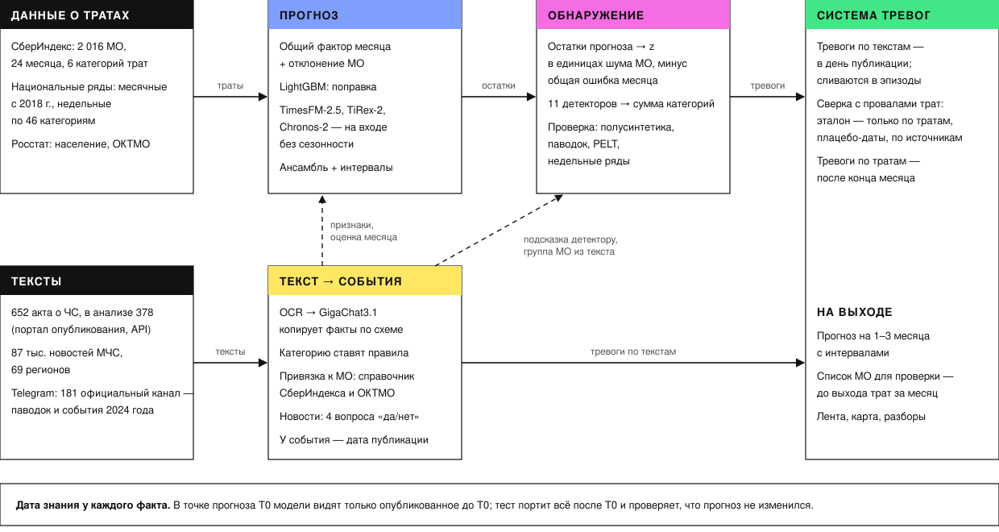

# Где искать шок

*Прогноз потребления в муниципалитетах и поиск местных шоков по данным СберИндекса и официальным текстам*

Онлайн-конкурс СберИндекса 2026, направление «Прогнозирование и обнаружение точек структурных изменений».

## Коротко

- **Прогноз вдвое точнее Prophet:** MAE 812 против 1 675 руб. на жителя в месяц, точнее в 98% из 2 016
  муниципалитетов (6 категорий, 11 точек прогноза 2024 г., горизонты 1–3).
- **Текст называет, где искать шок:** в паводок 2024 г. сайты МЧС до выхода данных о тратах назвали 30 районов;
  онлайн-покупки там на 5,8% ниже прогноза, а детекторы по тратам отметили бы лишь 1 из 30.
- **Граница вывода проверена:** на 146 других тяжёлых событиях 2024 г. из 181 официального Telegram-канала регионов
  такого сдвига нет — адрес из текста работает для бедствий масштаба паводка, а не для любого ЧС.



**Интерактивная страница:** https://vakuznetzovaclaud.github.io/sberindex/ (тот же файл — `site/index.html`, открывается
в браузере без сервера; печатная версия — `site/landing.pdf`). Методологический отчёт — `report/methodology.pdf`
(копия для ссылки со страницы — `site/methodology.pdf`), презентация на 12 слайдов — `site/presentation.pdf`.

| Критерий Положения | Отчёт | Страница |
|---|---|---|
| Методология | разделы 2–4 | материал 09 |
| Сравнение моделей прогноза | раздел 5 | материал 01 |
| Сравнение методов обнаружения структурных изменений | раздел 7 | материалы 03–04, 08 |
| Фундаментальные модели | раздел 6 | материал 02 |
| Интеграция новостей | разделы 8, 11–12 | материалы 05–08 |
| Метрики | раздел 3, таблицы раздела 5 | материал 01 |
| Интерпретация, воспроизводимость, обоснованность выводов | разделы 9–10, 12–14 | материалы 04, 08 |

## Главные результаты

- Ансамбль панельной модели, LightGBM и фундаментальных моделей ошибается вдвое меньше Prophet: MAE 812 против
  1 675 руб. на жителя в месяц (−52%; без декабря, где Prophet ошибается сильнее всего, −40%), точнее в 98%
  муниципалитетов. По «Все категории» даже лучшая из восьми настроек Prophet, выбранная задним числом, вдвое хуже
  ансамбля (1 619 против 808 на выборке 400 МО); в маркетплейсах Prophet с подбором настроек точнее (389 против 425).
- TimesFM-2.5, TiRex-2 и Chronos-2 выигрывают только на входе без сезонности; экспоненциальное сглаживание на том же
  входе отстаёт всего на 1,2%, а если заменить их сглаживанием, ансамбль теряет лишь 2,9%: решает подготовка входа.
- Сети TimeCast (LSTM, TCN, PatchTST), обученные с нуля по всем 2 016 МО на том же входе, в 1,7–1,9 раза точнее Prophet;
  TCN и PatchTST — на уровне панельной модели, LSTM слабее, и все уступают предобученным фундаментальным моделям и простому сглаживанию: на
  коротких рядах выигрывает предобучение на чужих рядах.
- Из 11 детекторов выбрана простая сумма отклонений по шести категориям (сумма Стауффера): 58% искусственных шоков
  размером 5–20% при 3% ложных тревог и наименьшая задержка. Ансамбли детекторов её не превосходят ни по полноте при
  3%, ни по задержке; по площади под кривой точность–полнота (VUS-PR) ансамбль рангов чуть выше (0,217 против 0,211),
  а выше всех — GLR по шести категориям (0,227). Нормировка остатков и ранги — только по прошлому. На реальных
  событиях отдельный муниципалитет шока в месячных тратах обычно не выдаёт.
- Сдвига общих трат при режимах ЧС в среднем не видно. Сильнее всего сдвиг у актов, называющих конкретные
  муниципалитеты: траты на маркетплейсах ниже на 4,0% (p = 0,037), но с поправкой на пять категорий это незначимо —
  лишь намёк того же знака, что и паводок. Система тревог «акт → провал в каждом МО акта» после плацебо и бутстрепа по кластерам сигнала не
  дала — это показано как отрицательный результат.
- В паводок 2024 года сайты МЧС до выхода данных о тратах назвали 30 подтопленных муниципалитетов; покупки на
  маркетплейсах там оказались на 5,8% ниже прогноза (у районов тех же регионов без сообщений — на 0,1%; против
  остальной страны p = 0,002, с поправкой на все 24 проверки — 0,049), а детекторы по тратам отметили бы из них
  лишь один. Текст не повышает точность месячного прогноза, но называет, где искать шок. На остальных 449 событиях
  года (154 тяжёлых) такой же сдвиг не воспроизводится: это свойство катастрофы масштаба паводка, а не общее правило
  «текст назвал муниципалитет — траты просели».

## Что внутри

| Часть | Где | Коротко |
|---|---|---|
| Данные с датой знания | `src/ews/panel.py`, `national.py`, `rosstat.py` | панель МО × месяц × 6 категорий, справочник МО, население, национальные месячные и недельные ряды портала |
| Прогноз | `src/ews/models.py`, `foundation.py`, `baselines.py`, `backtest.py`, `neural.py` | общий фактор месяца + отклонение МО, LightGBM, TimesFM-2.5 / TiRex-2 / Chronos-2 на сезонно скорректированном отклонении, сети TimeCast (LSTM, TCN, PatchTST) на том же входе, Prophet в трёх вариантах, классика на том же входе |
| Оценка прогноза | `src/ews/evaluate.py`, `scripts/eval_forecasts.py` | MAE, MAPE, WAPE, MASE, R² уровня и прироста г/г, R²_oos, тест Диболда–Мариано, ансамбли, конформные интервалы |
| Обнаружение | `src/ews/detect.py`, `synth.py`, `detect_eval.py`, `scripts/eval_detectors.py`, `eval_alarm_clusters.py` | 11 детекторов и 2 ансамбля, полусинтетика 4 форм × 3 размеров, VUS-PR, полнота при фиксированной доле ложных тревог, NAB; кластеры тревог на реальных МО-месяцах 2024 г. |
| Текст | `src/ews/acts.py`, `ocr.py`, `llm.py`, `events.py`, `news_mchs.py`, `news_classify.py`, `news_telegram.py`, `geo.py` | акты о ЧС → OCR → извлечение фактов открытой языковой моделью → правила → привязка к МО; новости МЧС и Telegram |
| Текст в моделях | `src/ews/text_features.py`, `warning.py`, `scripts/dose_response.py`, `eval_warning.py`, `eval_event_adjustment.py` | признаки с датой знания, наукаст, поправка на событие, байесовский текстовый априор, система предупреждений |
| Разборы | `src/ews/news_official.py`, `scripts/case_flood2024.py`, `eval_events_2024.py`, `offline_breaks.py`, `weekly_polygon.py` | события из официальных каналов, паводок 2024 г., проверка сдвига на других событиях года, ретроспективная карта разладок, недельный национальный полигон 2025–2026 |

## Как воспроизвести

Нужны Python 3.12 и системные программы: `curl`, `bsdtar` (libarchive; распаковка архива границ МО), `pdftoppm`
(poppler; страницы PDF актов), Tesseract с русским языком (на macOS вместо него системное OCR через `ocrmac`),
Chrome или Chromium (печать отчёта и страницы в PDF; путь можно задать переменной `CHROME`) и Ollama с моделью
разметки: `ollama pull hf.co/ai-sage/GigaChat3.1-10B-A1.8B-GGUF:Q4_K_M`.

```bash
python -m venv ~/.venvs/sberindex-prognoz
~/.venvs/sberindex-prognoz/bin/pip install -r requirements.txt
~/.venvs/sberindex-prognoz/bin/pip install -e .
make data        # панель МО, справочник, население, национальные ряды (снимок портала — data/snapshots/portal)
make texts       # акты о ЧС, новости МЧС, разметка (нужен Ollama с моделью из configs/base.yaml)
make forecasts   # 11 точек 2024 г. × горизонты 1–3 × 2 016 МО × 6 категорий
make prophet     # Prophet: по умолчанию на всех МО, TimeCast и сетка на выборке 400 МО
make evaluate    # таблицы, детекторы, система предупреждений, рисунки, отчёт
make site        # страница site/index.html, её PDF-версия и презентация site/presentation.pdf
make test        # нет заглядывания вперёд (прогнозы, кроме самого Prophet, вход FM, детекторы, тексты); метрики сверены с ручным счётом
```

Параметры (период, горизонты, источники, контрольные суммы скачиваемых наборов, ревизии весов фундаментальных
моделей, модель разметки) — `configs/base.yaml`; случайные зёрна зафиксированы в коде. Долгие шаги кэшируются на
диске: повторный запуск берёт уже скачанное, распознанное и размеченное. Время полного прогона на ноутбуке (12 ядер, без видеокарты): данные и тексты — несколько часов (скорость
порталов и разметки), фундаментальные модели — около 3 часов, Prophet — около 3 часов, оценка и сборка — минуты.
Ручная проверка разметки (40 актов и 50 новостей МЧС из случайных выборок с фиксированным зерном) — в
`report/checks/`; выборки выгружает `scripts/audit_samples.py`, вердикты хранятся в тех же файлах. Файл языковой
модели в Ollama закреплён по sha256 (`configs/base.yaml: llm.digest`; `src/ews/llm.py` сверяет его перед разметкой и
останавливается при расхождении), но полную побитовую воспроизводимость текстового слоя это не даёт — OCR-бэкенд
зависит от ОС (Apple Vision на macOS против Tesseract), и распознанный текст актов при повторном прогоне на другой
машине может немного отличаться.

## Данные и лицензии

Код — MIT (`LICENSE`). Данные и модели — на условиях их источников:

СберИндекс: потребительские безналичные расходы на уровне МО, справочник и границы МО, национальные ряды портала —
CC BY-SA 4.0. Росстат: база показателей муниципальных образований через каталог «Если быть точным» (CC BY 4.0)
и классификатор ОКТМО с портала открытых данных Росстата. Официальные акты — портал официального опубликования правовых актов (не охраняются авторским правом,
ст. 1259 ГК РФ). Новости — открытые сайты главных управлений МЧС России и публичные Telegram-каналы; тексты
хранятся локально и в репозиторий не входят; в результатах — даты, привязка к МО и ссылки, в `report/checks/` —
заголовки 50 новостей проверочной выборки.

Фундаментальные модели — TimesFM-2.5, TiRex-2, Chronos-2 (Apache-2.0); языковая модель — GigaChat3.1-10B-A1.8B (MIT),
работает локально через Ollama. OCR — Apple Vision на macOS (системный компонент, бесплатно) или Tesseract (Apache-2.0)
на других системах. Проприетарные платные технологии не используются.
