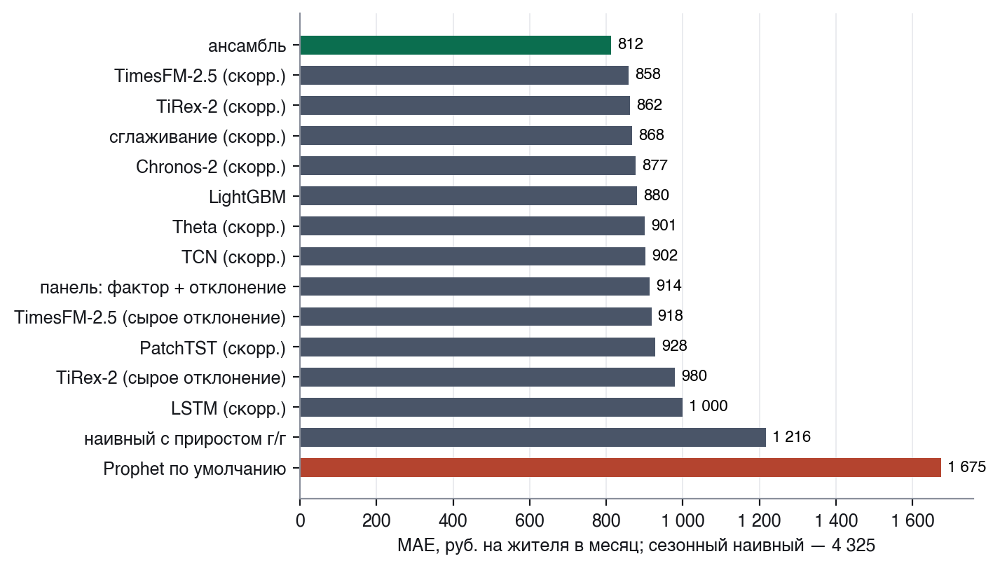
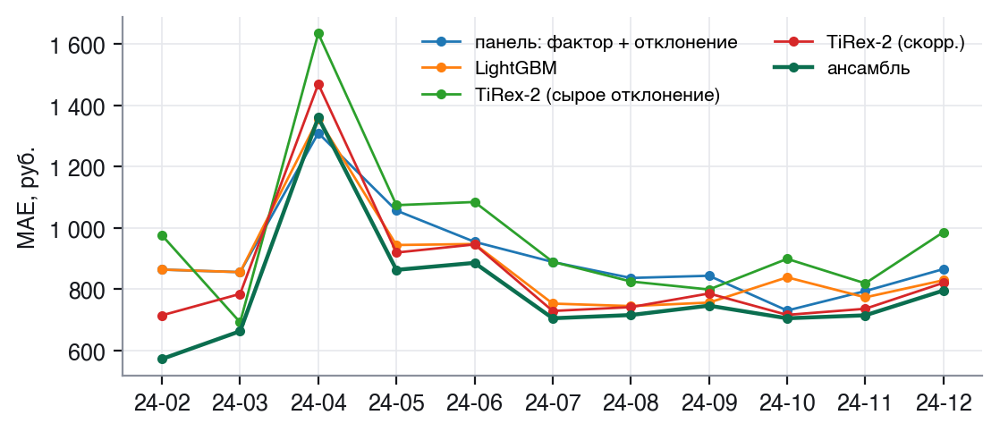
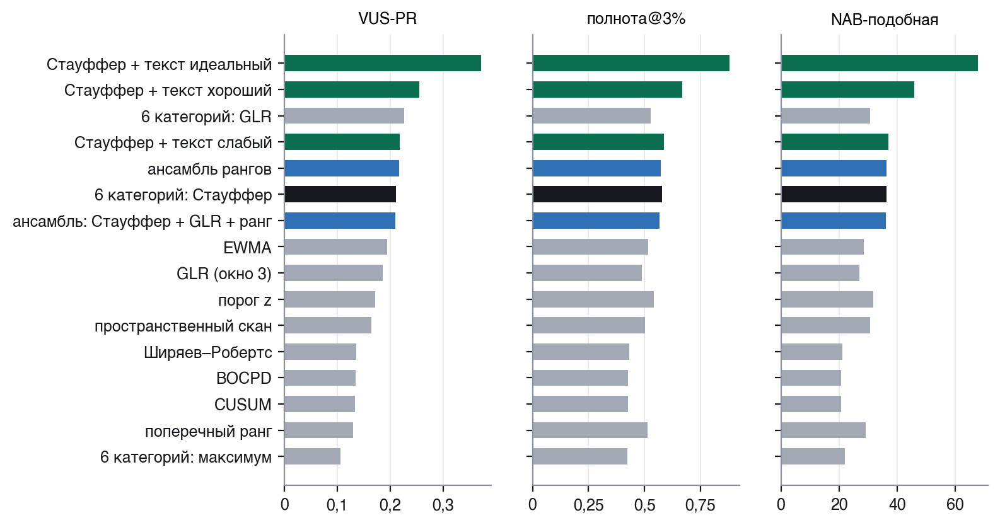
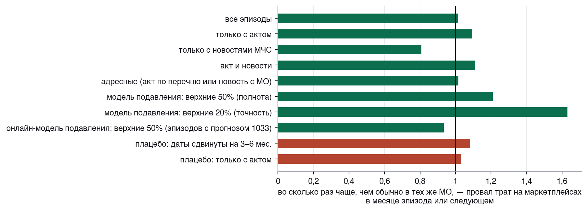

# Где искать шок: прогноз потребления в муниципалитетах и поиск местных шоков по данным СберИндекса и официальным текстам

Методологический отчёт. Онлайн-конкурс СберИндекса 2026, направление «Прогнозирование и обнаружение точек структурных
изменений».

## 1. Коротко

**Задача.** Прогноз безналичных потребительских расходов на жителя в 2 016 муниципальных образованиях (МО) на 1–3 месяца
вперёд по шести категориям и обнаружение местных шоков потребления — на данных СберИндекса, официальных актах о
режимах чрезвычайной ситуации (ЧС) и новостях МЧС.

**Главное.**

- Ансамбль панельной модели, LightGBM и трёх фундаментальных моделей (foundation models, далее FM) ошибается вдвое
  меньше Prophet: MAE по «Все
  категории» 812 против 1 675 руб. на жителя (−52%; без декабрьских целей, где Prophet проваливается сильнее всего, —
  −40%), лучше Prophet в 98% МО и в 10 месяцах-целях из 11; по категориям — от −17% (маркетплейсы) до −50% (общепит).
  Тест Диболда–Мариано: p = 0,029 / 0,046 / 0,15 на горизонтах 1 / 2 / 3. Наивный прогноз с приростом г/г — 1 216
  (ансамбль лучше на 33%). Восемь настроек Prophet из сетки дают по «Все категории» 1 619–1 658 на выборке 400 МО;
  даже лучшая, выбранная задним числом, вдвое хуже ансамбля (808 на тех же МО). По маркетплейсам Prophet с подбором
  настроек сильнее всех наших моделей (389 против 398 у LightGBM и 425 у ансамбля) — это показано отдельно.
- Фундаментальные модели TimesFM-2.5, TiRex-2 и Chronos-2 на 13–23 месячных точках не видят годового цикла (в декабре
  у TiRex-2 на сыром ряде MAE 5 957 против 821 на входе без сезонности), но становятся лучшими одиночными моделями
  по «Все категории», если отдать им готовый сезонный профиль: TimesFM-2.5 — 858. Экспоненциальное сглаживание на том
  же входе даёт 868 (+1,2%), ансамбль без FM — 836 (+2,9%): решает подготовка входа, вклад самих FM небольшой.
  Нейросети TimeCast (LSTM, TCN, PatchTST), обученные с нуля по всем 2 016 МО сразу на том же входе, в 1,7–1,9 раза точнее
  Prophet (902–1 000 против 1 675), TCN и PatchTST — на уровне панели (914), но все уступают и FM, и сглаживанию — предобучение на чужих
  рядах на таких коротких рядах сильнее обучения с нуля.
- Из 11 детекторов на искусственных шоках, внесённых в настоящие ряды, выбрана сумма Стауффера по шести категориям
  (сумма z-оценок остатков шести категорий, делённая на корень из их числа): 58% шоков при 3% ложных тревог и
  наименьшая задержка при любой доле ложных тревог; по площади под кривой точность–полнота (VUS-PR) её обходит GLR по
  шести категориям (отношение правдоподобия для сдвига среднего; 0,227 против 0,211). Ансамбли детекторов простую
  сумму заметно не превосходят: VUS-PR 0,209–0,217, полнота и задержка хуже. Нормировка остатков и ранги — только по
  прошлому, как в реальном времени. На реальных событиях из новостей МЧС месячные траты отдельного МО сдвига обычно не
  показывают — детекторы там на уровне случайного.
- Сдвига общих трат МО при режимах ЧС в среднем не видно (p = 0,83). Сильнее всего сдвиг у актов, называющих
  конкретные МО: траты на маркетплейсах −4,0% (16 актов, p = 0,037), но с поправкой на пять категорий это незначимо
  (0,18), а из 50 проверок значимы 2 — столько же, сколько ожидается случайно. Это намёк того же знака, что и паводок
  (ниже), а не доказанный эффект. Система тревог «акт → провал трат в каждом МО акта» сигнала не дала: провал в
  1,09 раза чаще, чем в тех же МО обычно (95%-й интервал 0,56–1,63), в плацебо — 1,03.
- В паводок 2024 г. текст назвал МО, которые детекторы по тратам пропустили. Сайты МЧС назвали 30 подтопленных МО до
  того, как стали известны траты за апрель (медиана — за 22 дня), поэтому список нельзя подогнать под провал задним
  числом. Покупки на маркетплейсах у этих МО оказались на 5,8% ниже прогноза, у МО тех же регионов без сообщений — на
  0,1%. Детекторы отметили бы в апреле 1 из 30 — почти на уровне случайного, а у группы в целом провал виден: против
  остальной страны p = 0,002, с поправкой на все 24 проверки разбора — 0,049. Проверка на 449 событиях 2024 г. без
  паводка (раздел 12) сдвига не находит (154 тяжёлых, в основном тесте 146, z Стауффера +0,45, p = 0,33): адресный эффект — свойство
  бедствия масштаба паводка, а не общее правило «текст назвал МО — траты просели».
- Точность месячного прогноза текст не повышает; его польза в другом — он называет, где искать шок.
- Главные числа проверены на устойчивость (плацебо, бутстреп по кластерам, поправка на множественные сравнения,
  окно контроля); что проверку не выдержало, показано как отрицательный результат или помечено как гипотеза
  (разделы 9, 10, 13).

**Где что по критериям.** Семь критериев Положения (направление «Прогнозирование», Приложение 2) разнесены по разделам:
простота и понятность методологии — разделы 2–4; сравнение моделей прогнозирования — раздел 5; сравнение методов
обнаружения структурных изменений — раздел 7; использование современных фундаментальных моделей — раздел 6; интеграция
новостных данных — разделы 8, 11–12; метрики качества, включая обязательную MAE, — раздел 3 и таблицы раздела 5;
интерпретация результатов, воспроизводимость и обоснованность выводов — разделы 9–10, 12–14.

**Архитектура.** Траты идут в прогноз; остатки прогноза — в детекторы; тексты превращаются в события с датой
публикации и списком МО и дают тревоги; текст проверен в прогнозе (признаки, оценка текущего месяца до выхода данных)
и входит в обнаружение (байесовская подсказка детектору, проверка по группе МО, которую называет текст).

*Схема работы: сплошные стрелки — основные потоки, пунктир — где текст проверен в прогнозе и где входит в обнаружение.*

## 2. Данные и дата знания

**Траты.** Муниципальный набор СберИндекса (архив хакатона Data → Sense с идентификатором территории `territory_id`):
безналичные потребительские расходы на жителя в месяц по шести категориям — «Все категории», продовольствие, здоровье,
общественное питание, маркетплейсы, транспорт — за 24 месяца 2023–2024 гг. Полная история по всем категориям есть у
2 016 муниципальных образований (МО) из 2 190 в наборе; на них и строится вся оценка. Из отброшенных 174 МО у 45
ряд обрывается в декабре 2023 г. и у 10 начинается в январе 2024 г. (похоже на преобразование районов в округа),
у остальных — пропуски или нет части категорий; выводы о них не делаются. Справочник МО СберИндекса даёт ОКТМО, регион,
координаты центра и тип МО; численность населения — база показателей муниципальных образований Росстата (каталог
«Если быть точным»), найдена для 2 014 МО из 2 016.

Восьми регионов в наборе нет совсем (Крым, Севастополь, Краснодарский край, Ростовская, Воронежская, Курская,
Брянская, Белгородская области), ещё у четырёх (Бурятия, Дагестан, Ингушетия, Чечня) ни у одного МО нет полной
истории, поэтому события в них — например, августовские бои 2024 г. в Курской области — в работе не видны и в кейсы
не берутся.

**Национальные ряды.** Портал открытых данных СберИндекса: месячные расходы по стране с декабря 2018 г. («Всего»,
продовольственные товары, общественное питание, услуги, непродовольственные товары) и недельные приросты г/г по
46 категориям с ноября 2023 г. Длинный национальный ряд нужен там, где у панели всего 1–3 месяца для оценки прироста.

**Официальные акты.** Портал официального опубликования правовых актов (`publication.pravo.gov.ru`, открытый API):
акты глав и правительств субъектов о режимах чрезвычайной ситуации (ЧС) и повышенной готовности за 2023–2024 гг. —
652 акта: 133 — в регионах без данных о тратах, 141 — отмены режима, 378 — остальные акты покрытых регионов; из них
260 вводят или меняют режим (51 из них — правки актов прошлых лет, не новые события, раздел 8; новых событий — 209), а 118 событиями не являются (выплаты пострадавшим, резервный фонд, субсидии, правила
поведения при режимах). У каждого акта две
даты: подписания и официального опубликования.

**Новости.** Архивы новостей сайтов главных управлений МЧС России по субъектам (`<код>.mchs.gov.ru`): единая разметка
у всех регионов, фильтр по датам, у каждой новости — заголовок, дата и время публикации. Собраны заголовки за
2023–2024 гг. по 69 регионам (87 413 новостей). Для проверки, повторяется ли сдвиг с паводка на других событиях
2024 г. (раздел 12), источник шире — 181 официальный Telegram-канал (ГУ МЧС, губернаторы или правительства,
ЦУР/ЕДДС/ГОЧС) 73 регионов.

**Дата знания.** У каждого значения хранится момент, когда оно стало известно: траты МО за месяц t — после конца
месяца t; акт — в день официального опубликования; новость — в момент публикации. Признак, построенный для прогноза
из точки T0, собирается только из того, что известно к T0. Это не декларация: тест `tests/test_no_leakage.py` для
наивных моделей, панели, LightGBM, сглаживания на скорректированном входе (метод Theta), входа TimesFM-2.5, TiRex-2 и
Chronos-2 во всех вариантах, онлайн-подбора настроек Prophet и ансамбля с весами по прошлой ошибке портит все данные
после T0 (траты всех категорий — случайным множителем от 0,5 до 2, национальный ряд — втрое, текстовые признаки —
случайными счётчиками) и проверяет, что прогноз из T0 не изменился; так же проверяются детекторы и текстовые признаки
(раздел 14). Сам Prophet — внешняя библиотека, он обучается только на ряде до T0.

## 3. Протокол оценки

**Скользящее начало.** Последний наблюдённый месяц T0 пробегает 2024-01…2024-11 (11 точек), горизонты h = 1, 2, 3,
цели — все месяцы 2024 г. с февраля по декабрь включительно (декабрь — самый трудный месяц года, исключать его нельзя).
Каждая модель в каждой точке видит только данные до T0. На одну модель и категорию — 60 480 прогнозов
(2 016 МО × 30 пар «точка — горизонт»).

**Окна.** Решения о конструкции моделей принимались на окне «разработка» (точки прогноза 01–06.2024) и проверялись на
окне «контроль» (07–11.2024), которое при выборе не использовалось — кроме сжатия сезонного профиля и веса
национального ряда (раздел 13).

**Метрики.** MAE в рублях на жителя — главная (её требует Положение); MAPE и WAPE — относительные; MASE — к среднему
абсолютному приросту ряда МО; R² уровня; R² прироста г/г (доля объяснённой дисперсии годового прироста — строже R²
уровня, который почти всегда близок к 1 из-за разброса МО по уровню трат); R²_oos к сезонному наивному прогнозу; доля МО, где модель
лучше Prophet; тест Диболда–Мариано с поправкой Харви–Лейборна–Ньюболда на месячных рядах потерь (если оценка
дисперсии с автоковариациями отрицательна — с h = 1, как в `forecast::dm.test`). Для интервальных
прогнозов — покрытие, ширина и интервальная оценка WIS.

## 4. Модели прогноза

**Базовые модели.** Prophet — базовая модель задания — в трёх вариантах: по умолчанию (годовая сезонность при истории меньше двух
лет автоматически отключается), в конфигурации библиотеки TimeCast (годовая и недельная сезонность включены
принудительно) и с подбором настроек по сетке из 8 вариантов, где в каждой точке прогноза выбирается вариант с
наименьшей ошибкой на уже наблюдённых целях прошлых точек. Медленные конфигурации Prophet считаются на
стратифицированной по численности выборке 400 МО, сравнение с ними — на тех же 400 МО. Кроме Prophet — сезонный
наивный прогноз и сезонный наивный прогноз с приростом г/г за три месяца.

**Панельная структура.** В одном ряде МО 13–23 точки — меньше двух годовых циклов, отдельно по ряду годовую
сезонность не оценить. Поэтому логарифм трат раскладывается на общий фактор месяца (медиана по всем МО) и отклонение
МО от него. Фактор прогнозируется «в лоб» через год назад и прирост г/г, оценённый равной смесью панели и национального
ряда той же категории за три месяца (национальный ряд идёт с 2018 г., поэтому оценка устойчива и в начале 2024 г.).
Отклонение МО — уровень последних месяцев плюс сезонное отклонение МО прошлого года, умноженное на λ = 0,7
(доля профиля, которая переносится на следующий год).
Значение задано заранее, одно на все модели и категории. Чувствительность: панельная модель по «Все категории» с
λ = 0,5 точнее (874 против 914, и на окне разработки — 953 против 1 002); лучшее λ по категориям разное (0,3 в
продовольствии и маркетплейсах, 0,7 в здоровье и транспорте); LightGBM с λ = 0,5 хуже (894 против 880). Ансамбль к
выбору почти нечувствителен: если панель и LightGBM считать при λ = 0,5, MAE — 814 против 812
(`outputs/tables/forecast_lambda.csv`).

**LightGBM.** Глобальная модель по всем МО и прошлым точкам прогноза учит поправку к отклонению панельной модели
(признаки — недавний прирост отклонения, сезонное отклонение, изменения за месяц и за год, горизонт, месяц, численность,
регион; потеря — абсолютная ошибка). Модель обучается с точки 2024-03, когда накоплено хотя бы два прошлых блока
«точка × горизонт» с известной целью; в точках 2024-01 и 2024-02 прогноз LightGBM совпадает с панельным.

**Фундаментальные модели** (веса с открытыми лицензиями Apache-2.0): TimesFM-2.5 (Google), TiRex-2 (NX-AI), Chronos-2
(Amazon). Каждой подаётся не сырой ряд, а отклонение МО от общего фактора, из которого вычтен собственный сезонный
профиль МО за 2023 г., умноженный на λ = 0,7; профиль прибавляется к прогнозу обратно. Годовой цикл по 13–23 точкам FM не
выучит — его отдают готовым, а FM прогнозирует уровень и тренд отклонения (подробности и замеры — раздел 6).
Для Chronos-2 дополнительно — совместный прогноз батчами МО, упорядоченных по коду региона (cross-learning), и
дообучение всех весов в каждой точке.

**Классика на том же входе.** Экспоненциальное сглаживание, метод Theta и наивный прогноз на том же сезонно скорректированном
отклонении — чтобы отделить вклад FM от вклада коррекции входа.

**Нейросети TimeCast.** Библиотека TimeCast (github.com/Sorooshi/TimeCast, коммит `eaf2a6d`; код скачивается на
закреплённом коммите и не копируется в этот репозиторий — лицензии в TimeCast нет), из которой взята одна из
конфигураций Prophet (выше), даёт и три нейросетевые архитектуры — LSTM, TCN, PatchTST (`src/ews/neural.py`, модели
`lstm_sa`, `tcn_sa`, `patchtst_sa` в `scripts/run_forecasts.py`; LSTM и PatchTST — переменная `TIMECAST` в Makefile,
по всем категориям, TCN — отдельной строкой, только по «Все категории», см. ниже). Постановка задана до
расчёта: одна модель на все 2 016 МО сразу — на 13–23 точках одного ряда сеть не обучить; вход тот же, что у FM
(выше) — отклонение МО от общего фактора без сезонного профиля 2023 г.; скользящее окно 6 месяцев (у PatchTST патч —
3), центрированное собственным средним; отдельная модель на каждый горизонт; архитектуры, функция потерь (MSE) и
оптимизатор с шагом по умолчанию — из TimeCast (LSTM и TCN — 1e-3, PatchTST — 1e-4); 30 эпох, батч 256, зерно 42.
Обучение — только на истории до точки прогноза; это отдельно проверяет тест `tests/test_no_leakage.py::test_timecast_models_do_not_leak`
(раздел 14). На процессоре TCN учится 4–10 минут на модель, поэтому посчитан только по «Все категории»; LSTM и
PatchTST — и по «Все категории», и по каждой из пяти категорий (раздел 5). В ансамбль модели не входят — его состав
зафиксирован заранее (ниже).

**Ансамбль.** Среднее с равными весами панельной модели, LightGBM и трёх FM. Состав задан заранее, без отбора по
тестовой ошибке; веса по обратной ошибке прошлых точек дают то же самое (812,1 против 812,2), медиана — хуже среднего
(845; `outputs/tables/forecast_ensembles.csv`). Ансамбль одних трёх FM без панели и LightGBM даёт 854.

**Интервалы.** Скользящий сплит-конформный метод: в точке T0 интервал — квантили лог-остатков той же модели и
горизонта по целям, уже наблюдённым к T0, отдельно по квинтилям численности МО.

## 5. Сравнение моделей прогноза

«Все категории», все 11 точек 2024 г., h = 1–3, 2 016 МО (60 480 прогнозов на модель). DM — p-значения теста
Диболда–Мариано против Prophet по умолчанию на горизонтах 1/2/3.

| Модель | MAE, ₽ | MAPE, % | WAPE, % | MASE | R² г/г | R²_oos | МО лучше Prophet | DM p |
|---|---|---|---|---|---|---|---|---|
| **ансамбль** | **812** | **2,87** | **2,59** | **0,440** | **0,382** | **0,946** | 98% | 0,029/0,046/0,154 |
| TimesFM-2.5 (скорр.) | 858 | 3,00 | 2,73 | 0,463 | 0,353 | 0,942 | 97% | 0,033/0,062/0,187 |
| TiRex-2 (скорр.) | 862 | 3,02 | 2,75 | 0,466 | 0,339 | 0,941 | 98% | 0,035/0,067/0,192 |
| Chronos-2 совместный (скорр.) | 863 | 3,04 | 2,75 | 0,467 | 0,318 | 0,940 | 98% | 0,037/0,072/0,201 |
| Chronos-2 (скорр.) | 877 | 3,08 | 2,79 | 0,474 | 0,294 | 0,938 | 98% | 0,038/0,080/0,228 |
| LightGBM | 880 | 3,03 | 2,80 | 0,467 | 0,336 | 0,936 | 99% | 0,045/0,062/0,167 |
| TCN (TimeCast) | 902 | 3,12 | 2,87 | 0,485 | 0,315 | 0,937 | 98% | 0,040/0,069/0,184 |
| панель: фактор + отклонение | 914 | 3,17 | 2,91 | 0,489 | 0,274 | 0,934 | 97% | 0,045/0,080/0,210 |
| TimesFM-2.5 (сырое отклонение) | 918 | 3,06 | 2,92 | 0,480 | 0,369 | 0,930 | 99% | 0,042/0,087/0,244 |
| PatchTST (TimeCast) | 928 | 3,15 | 2,96 | 0,495 | 0,330 | 0,933 | 97% | 0,041/0,077/0,182 |
| LSTM (TimeCast) | 1 000 | 3,42 | 3,19 | 0,532 | 0,156 | 0,920 | 96% | 0,054/0,111/0,445 |
| наивный с приростом г/г | 1 216 | 4,31 | 3,87 | 0,661 | −0,351 | 0,889 | 83% | 0,146/0,363/0,635 |
| **Prophet по умолчанию** | 1 675 | 5,36 | 5,34 | 0,894 | −0,793 | 0,762 | — | — |
| сезонный наивный | 4 325 | 13,58 | 13,78 | 2,275 | −7,220 | 0 | 3% | — |

Ансамбль против соседних моделей (тот же тест, горизонты 1/2/3; `outputs/tables/forecast_dm_pairs.csv`): TimesFM-2.5
(скорр.) — p = 0,02 / 0,12 / 0,05, TiRex-2 (скорр.) — 0,01 / 0,06 / 0,12, Chronos-2 совместный с ковариатами (859) —
0,05 / 0,16 / 0,36, LightGBM — 0,01 / 0,003 / 0,002, наивный с приростом г/г — < 0,001 / 0,02 / 0,02. На горизонте 1
ансамбль точнее каждой из соседних моделей (p = 0,01–0,05 без поправки на число сравнений). На горизонтах 2–3 в
каждом ряду всего 9–10 месяцев-целей, и p неустойчиво: у LightGBM оно падает до 0,002–0,003, у FM остаётся 0,05–0,36;
выводы о них не делаются.

*Рис. 1. MAE моделей по «Все категории»; зелёный — ансамбль, красный — Prophet.*

**Prophet в трёх вариантах** (выборка 400 МО, стратифицированная по численности; ансамбль на тех же МО):

| Категория | Prophet по умолчанию | TimeCast | Prophet с подбором | ансамбль |
|---|---|---|---|---|
| Все категории | 1 680 | 101 872 | 1 682 | **808** |
| Продовольствие | 878 | 44 354 | 692 | **446** |
| Здоровье | 131 | 5 210 | **100** | 101 |
| Общественное питание | 163 | 4 500 | 118 | **82** |
| Маркетплейсы | 526 | 15 732 | **389** | 425 |
| Транспорт | 158 | 6 188 | 141 | **126** |

Prophet с гиперпараметрами из библиотеки TimeCast рассчитан на длинные ряды: на 13–23 месячных точках принудительная
годовая и недельная сезонность перепараметризует модель (гармоник больше, чем точек), и прогноз расходится. Поэтому основная
базовая модель — Prophet по умолчанию и с подбором. По «Все категории» онлайн-подбор не помогает (1 682 против 1 680),
хотя каждая из восьми настроек сетки, взятая целиком на все точки, лучше обоих: 1 619–1 658. Правило «в каждой точке
взять настройку с наименьшей прошлой ошибкой» на коротких рядах выбирает шумно; но и лучшая настройка, выбранная
задним числом по тесту, вдвое хуже ансамбля (808). По отдельным категориям онлайн-подбор улучшает Prophet на 11–28%;
против Prophet с подбором ансамбль выигрывает в продуктах, общепите и транспорте, в здоровье — вровень (101 против
100), в маркетплейсах уступает 9%.
По маркетплейсам Prophet с подбором лучше всех наших моделей (LightGBM — 398): у категории сильный и меняющийся
тренд, и выбранные подбором настройки с гибкой трендовой частью его ловят.

**Как читать метрики.** MAE в рублях определяется МО с высокими тратами; MAPE одинаково взвешивает все МО; WAPE —
MAE, делённая на средний уровень; MASE сравнивает ошибку со средним месячным изменением ряда МО. R² уровня здесь не
информативен (он близок к 1 у любой разумной модели из-за разброса МО по уровню трат), поэтому главный R² — прироста
г/г: у Prophet он отрицателен (хуже, чем предсказать средний прирост), у ансамбля — 0,38. Часть этого R² — общий для
всех МО прирост месяца; R² прироста внутри одного месяца цели (разброс МО между собой), усреднённый по месяцам, —
0,32. R²_oos к более сильной базе — наивному прогнозу с приростом г/г — 0,52: квадратичная ошибка ансамбля на 52%
меньше.

*Рис. 2. MAE по месяцам цели. У всех показанных моделей худший месяц — апрель 2024 г. (прирост к I кварталу 2023 г.
искажён сдвигом весной 2023 г., раздел 13). Prophet на рисунке нет: его декабрь (4 485) сжал бы шкалу; в апреле он,
наоборот, лучше ансамбля (1 145 против 1 360) — единственный из 11 месяцев, где ансамбль уступает.*

**Декабрь.** Самый трудный месяц года входит в оценку (раздел 3): у Prophet по умолчанию MAE в декабре — 4 485, у
ансамбля — 795. Без декабрьских целей разрыв ансамбля с Prophet — 40% вместо 52%.

**Окна.** На окне разработки (точки 01–06.2024) ансамбль — 876, на контроле (07–11.2024), не участвовавшем в выборе
конструкции, — 717. Тест Диболда–Мариано на
контроле: p = 0,12 / 0,15 / 0,22 — выигрыш того же знака, но в окне всего 3–5 месяцев-целей на горизонт, и тест
на таком ряду маломощен. Контроль нетронут не полностью: сжатие сезонного профиля (λ = 0,7) и вес национального ряда
проверялись на всех точках. По категориям на контроле ансамбль уступает в продовольствии наивному прогнозу с
приростом г/г и панели без национального ряда (554 против 472 и 429), в маркетплейсах — LightGBM (608 против 553).

**Модель × категория** (все МО, все точки 2024 г., h = 1–3; жирным — лучшая из показанных моделей в категории).

MAE, руб. на жителя:

| Модель | Все | Продукты | Здоровье | Общепит | Маркетплейсы | Транспорт |
|---|---|---|---|---|---|---|
| ансамбль | **812** | 447 | **100** | **83** | 430 | 129 |
| TimesFM-2.5 (скорр.) | 858 | 466 | 104 | 92 | 470 | 138 |
| TiRex-2 (скорр.) | 862 | 462 | 103 | 89 | 449 | 136 |
| Chronos-2 совместный (скорр.) | 863 | 457 | 104 | 86 | 436 | 137 |
| Chronos-2 ковариаты + совм. (скорр.) | 859 | 458 | 104 | 85 | 441 | 136 |
| Chronos-2 (скорр.) | 877 | 451 | 106 | 89 | 434 | 143 |
| LightGBM | 880 | **443** | 103 | 99 | **405** | 127 |
| TCN (TimeCast) | 902 | — | — | — | — | — |
| панель | 914 | 475 | 101 | 104 | 460 | **123** |
| PatchTST (TimeCast) | 928 | 470 | 105 | 104 | 484 | 126 |
| LSTM (TimeCast) | 1 000 | 489 | 104 | 107 | 516 | 136 |
| панель без нац. ряда | 1 148 | 459 | 101 | 109 | 460 | **123** |
| наивный с приростом г/г | 1 216 | 492 | 106 | 107 | 503 | 130 |
| Prophet по умолчанию | 1 675 | 880 | 131 | 165 | 521 | 159 |

MAPE, %:

| Модель | Все | Продукты | Здоровье | Общепит | Маркетплейсы | Транспорт |
|---|---|---|---|---|---|---|
| ансамбль | **2,87** | 3,69 | **7,52** | **11,58** | 8,96 | 8,06 |
| TimesFM-2.5 (скорр.) | 3,00 | 3,85 | 7,76 | 12,22 | 9,69 | 8,34 |
| TiRex-2 (скорр.) | 3,02 | 3,81 | 7,74 | 12,14 | 9,36 | 8,40 |
| Chronos-2 совместный (скорр.) | 3,04 | 3,76 | 7,80 | 12,12 | 9,15 | 8,53 |
| Chronos-2 ковариаты + совм. (скорр.) | 3,02 | 3,76 | 7,84 | 12,08 | 9,22 | 8,48 |
| Chronos-2 (скорр.) | 3,08 | 3,71 | 7,92 | 12,23 | 9,09 | 8,81 |
| LightGBM | 3,03 | **3,67** | 7,59 | 12,25 | **8,61** | **7,98** |
| TCN (TimeCast) | 3,12 | — | — | — | — | — |
| панель | 3,17 | 3,90 | 7,80 | 13,23 | 9,63 | 8,22 |
| PatchTST (TimeCast) | 3,15 | 3,84 | 7,78 | 12,97 | 10,20 | 8,14 |
| LSTM (TimeCast) | 3,42 | 3,99 | 7,81 | 13,51 | 11,24 | 8,65 |
| панель без нац. ряда | 4,04 | 3,79 | 7,80 | 14,18 | 9,63 | 8,22 |
| наивный с приростом г/г | 4,31 | 4,06 | 8,48 | 15,43 | 10,63 | 8,93 |
| Prophet по умолчанию | 5,36 | 7,02 | 9,56 | 18,26 | 10,20 | 9,85 |

R² годового прироста:

| Модель | Все | Продукты | Здоровье | Общепит | Маркетплейсы | Транспорт |
|---|---|---|---|---|---|---|
| ансамбль | **0,38** | **0,28** | 0,19 | **0,43** | 0,71 | 0,23 |
| TimesFM-2.5 (скорр.) | 0,35 | 0,21 | 0,15 | 0,39 | 0,61 | 0,19 |
| TiRex-2 (скорр.) | 0,34 | 0,23 | 0,15 | 0,39 | 0,66 | 0,17 |
| Chronos-2 совместный (скорр.) | 0,32 | 0,25 | 0,13 | 0,38 | 0,69 | 0,15 |
| Chronos-2 ковариаты + совм. (скорр.) | 0,32 | 0,25 | 0,12 | 0,39 | 0,69 | 0,15 |
| Chronos-2 (скорр.) | 0,29 | 0,26 | 0,10 | 0,37 | 0,69 | 0,10 |
| LightGBM | 0,34 | 0,27 | **0,19** | 0,42 | **0,74** | **0,24** |
| TCN (TimeCast) | 0,32 | — | — | — | — | — |
| панель | 0,27 | 0,20 | 0,10 | 0,29 | 0,67 | 0,16 |
| PatchTST (TimeCast) | 0,33 | 0,22 | 0,15 | 0,34 | 0,64 | 0,21 |
| LSTM (TimeCast) | 0,16 | 0,17 | 0,13 | 0,28 | −3,02 | 0,11 |
| панель без нац. ряда | −0,19 | 0,21 | 0,10 | 0,21 | 0,67 | 0,16 |
| наивный с приростом г/г | −0,35 | 0,07 | −0,13 | −0,02 | 0,55 | −0,06 |
| Prophet по умолчанию | −0,79 | −1,26 | −0,15 | 0,04 | 0,72 | −0,08 |

Лучшие модели по категориям разные: ансамбль — «Все категории», здоровье, общепит; LightGBM — продукты и маркетплейсы;
панельная модель — транспорт. Ансамбль нигде не проигрывает лучшей модели категории по MAE больше чем на 6,2% и
обходит Prophet по умолчанию во всех шести категориях; по R² прироста он первый или вровень с первым везде,
кроме маркетплейсов (LightGBM 0,74 и Prophet 0,72 против 0,71) и транспорта (LightGBM 0,24 против 0,23).

**Нейросети TimeCast.** TCN, PatchTST и LSTM (постановка — раздел 4), обученные с нуля по всем МО сразу, по «Все
категории» дают 902, 928 и 1 000 — в 1,7–1,9 раза точнее Prophet по умолчанию (1 675); TCN и PatchTST на уровне
панельной модели (914), LSTM на 9% хуже неё; все три хуже каждой из FM (858–877) и экспоненциального сглаживания на том же входе (868, раздел 6). Считаны по категориям
PatchTST и LSTM (TCN — только «Все категории», раздел 4): в транспорте PatchTST (126) — второе место после панели
(123) и лучше всех FM; у LSTM в маркетплейсах обучение с нуля не сошлось (R² годового прироста −3,02 против
0,64–0,74 у панели, PatchTST и LightGBM). Правило то же, что и для FM: на 13–23 точках решает не архитектура, а подготовка входа —
предобучение на чужих рядах (FM) или простое сглаживание на аккуратно скорректированном входе точнее, чем сеть,
обученная с нуля по всем МО.

**Интервалы** (скользящий конформный метод, ансамбль, «Все категории»): покрытие 80%-интервала 0,78 / 0,75 / 0,55 на
горизонтах 1/2/3, ширина — 8–11% прогноза. На горизонте 3 интервалы узки: остатки ранних точек не похожи на поздние
(декабрь).

**WIS.** По «Все категории» интервальная оценка WIS ансамбля — 344 / 383 / 545 руб. на горизонтах 1/2/3 (панель — 373 /
413 / 537, LightGBM — 387 / 408 / 513); MAE ансамбля на тех же горизонтах — 685 / 810 / 970. WIS ниже MAE: интервалы
добавляют информацию сверх точечного прогноза. На горизонте 3 ансамбль уступает LightGBM по WIS (545 против 513) —
из-за недопокрытия 80%-интервала (55% вместо 80%, см. выше), хотя по точечной MAE на этом горизонте ансамбль всё ещё
не хуже. Интервалов Prophet в сохранённых прогнозах нет: WIS считается только для моделей со скользящими конформными
интервалами (панель, LightGBM, ансамбль).

## 6. Фундаментальные модели: где они выигрывают и где нет

**Ограничение: годовой цикл по 13–23 точкам не выучить.** TiRex-2 на логарифме сырого ряда МО даёт MAE 2 351, в
декабре — 5 957: модель продолжает осенний уровень и не знает о новогоднем пике. На отклонении МО от общего фактора
(общую сезонность забирает фактор) — 980, декабрь перестаёт выделяться. Но и отклонение МО сезонно (курорты летом,
северные МО в сезон завоза): на точке прогноза 2024-11, где все цели — декабрь, TimesFM-2.5 и TiRex-2 на отклонении
хуже панельной модели на 15% и 25%.

**Решение: отдать FM готовый сезонный профиль.** Из отклонения вычитается собственный профиль МО за 2023 г.,
умноженный на 0,7, и FM прогнозирует то, что осталось, — уровень и тренд; профиль прибавляется обратно. TimesFM-2.5: 918 → 858,
TiRex-2: 980 → 862 — это лучшие одиночные модели по «Все категории». Скорректированные FM лучше панельной модели в 10 точках
прогноза из 11; исключение — январь 2024 г. (контекст 13 месяцев), где профиль 2023 г. несёт сдвиг данных I квартала.

**Преимущество FM невелико и неустойчиво.** Экспоненциальное сглаживание на том же скорректированном входе даёт 868 —
всего на 0,6% хуже TiRex-2 на всех точках и даже лучше на окне разработки (936 против 944); на контроле FM впереди на
3,4% (740 против 766). Большая часть выигрыша — от правильного входа, а не от модели. И коррекция входа помогает
не везде: в продовольствии и маркетплейсах TiRex-2 на отклонении без коррекции точнее, чем с ней (445 против 462 и
424 против 449): профиль 2023 г. в этих категориях на 2024 г. переносится плохо. В ансамбле то же: если три FM
заменить сглаживанием на том же входе (панель + LightGBM + сглаживание), MAE — 836 против 812, вклад FM — 2,9%.
По категориям лучшие одиночные модели разные: в продуктах и маркетплейсах — LightGBM, в здоровье и транспорте —
панельная модель, в общепите — Chronos-2 с совместным прогнозом и ковариатами (85 против 90 у сглаживания).

**Совместный прогноз и дообучение.** Chronos-2 умеет прогнозировать ряды батча совместно (cross-learning): если
ряды МО упорядочить по коду региона и прогнозировать батчами по 100 рядов (в батче — МО 2–7 соседних по коду
регионов), ошибка падает с 877 до 863 — вровень с TimesFM-2.5 и TiRex-2. Ещё одна возможность Chronos-2 —
ковариаты: к ряду категории подаются такие же сезонно скорректированные ряды пяти остальных
категорий того же МО (только прошлое — их будущие значения неизвестны). Эффект почти нулевой: 876 против 877 без
совместного прогноза и 859 против 863 с ним; по категориям то чуть лучше (общепит, транспорт), то чуть хуже
(маркетплейсы, продукты, здоровье). Дообучение всех весов модели в каждой точке прогноза на 13–23 точках всех МО не
помогло: 1 287 при шаге обучения 1e-4 и 300 шагах, 1 193 при шаге 1e-5 и 150 шагах против 877 без дообучения. У
второго варианта на окне разработки (контекст 13–18 месяцев) ошибка в полтора раза больше, чем без дообучения (1 499
против 968), на контроле (19–23 месяца) почти та же (734 против 741) — по окну разработки выбирается модель без
дообучения. На рядах такой длины FM стоит применять без дообучения.

**Сводка: что сработало у FM, что нет.**

| Приём | Итог | Числа (MAE, «Все категории») |
|---|---|---|
| Готовый сезонный профиль вместо сырого ряда | сработало — лучшие одиночные модели | TimesFM-2.5: 918 → 858; TiRex-2: 980 → 862 |
| Совместный прогноз батчами (cross-learning), Chronos-2 | сработало частично | 877 → 863, вровень с TimesFM-2.5 и TiRex-2 |
| Ковариаты — пять остальных категорий того же МО, Chronos-2 | почти ноль | 876 против 877 без совместного прогноза; 859 против 863 с ним |
| Дообучение всех весов в каждой точке, Chronos-2 | не сработало | 1 287 (шаг 1e-4, 300 шагов) и 1 193 (шаг 1e-5, 150 шагов) против 877 без дообучения |

Против сетей, обученных с нуля по всем МО сразу (LSTM, TCN, PatchTST библиотеки TimeCast, раздел 4 и 5): у лучшей из
них (TCN, 902) ошибка выше, чем у любой FM (858–877) и у сглаживания на том же входе (868) — на таких коротких рядах
чужая история, отданная FM, точнее собственной архитектуры, обученной с нуля.

## 7. Обнаружение структурных изменений

**Вход детекторов.** Все детекторы работают на остатках одношагового прогноза панельной модели (раздел 4):
e = log факт − log прогноз; z = (e − медиана e ряда МО) / MAD ряда МО (у малых МО шум в разы больше, чем у
крупных), затем из z вычитается его медиана по всем МО того же месяца. Медиана и MAD МО считаются только по прошлым месяцам (пока их меньше шести — шум берётся по
месячным изменениям отклонения МО за 2023 г.), как работал бы детектор в реальном времени: в оценку не попадают ни
будущее, ни сам внесённый шок. Вычитание медианы месяца убирает общую для страны ошибку месяца (промах прогноза общего
фактора), которая не является местным шоком. Вычитать её важно именно из z, а не из сырых остатков: у крупных и малых МО разная доля
общей ошибки. Ищутся падения, поэтому оценка тревожности — −z.

**Методы.** Порог по z; CUSUM; EWMA; Ширяев–Робертс; упрощённый BOCPD (Adams & MacKay 2007) с двумя режимами среднего
(считается в лог-шансах, иначе при сдвиге в десятки σ обе плотности обнуляются); GLR с ограниченным окном (Lai 1995):
отношение правдоподобия для сдвига среднего неизвестной величины, максимизированное по моменту начала сдвига в
последние 3 месяца, — ловит и разовый провал, и ступеньку; при одном сдвиге в окне это тот же критерий, что у бинарной сегментации и PELT
с порогом в роли штрафа;
поперечный ранг МО среди всех МО месяца; многомерные по
шести категориям — максимум и сумма Стауффера (сумма z категорий, делённая на корень из их числа); GLR на сумме
Стауффера; пространственный скан по 1–8 ближайшим МО (у 242 внутригородских МО Москвы и Петербурга координаты центра —
по полигону из справочника границ); два ансамбля — среднее рангов нескольких детекторов, ранг считается среди МО того
же месяца, поэтому ансамбль тоже не видит будущего.

**Полусинтетика.** В настоящую панель вносятся шоки четырёх форм — ступенька, провал с восстановлением (как у паводка:
удар и отскок), рампа, отраслевой (падают маркетплейсы и транспорт, «Все категории» — на их долю) — трёх размеров
(5, 10, 20%), одиночные и кластерные (5 соседних МО), по 60 событий с началом в 2024-04…2024-10; три повтора каждого
из 24 условий. Остатки считаются заново для каждой искажённой панели.

**Метрики.** Полнота при 1, 3 и 5% ложных тревог в чистых МО-месяцах и средняя задержка; площадь под кривой
точность–полнота с допуском по времени, усреднённая по допускам 0–2 месяца (аналог VUS-PR, Liu & Paparrizos 2024) —
не зависит от порога; «F1 с допуском» — наибольший по всем порогам F1 (гармоническое среднее точности и полноты) при том же
допуске в 2 месяца после начала шока; NAB-подобная оценка (Lavin & Ahmad 2015): награда за раннее срабатывание (1 в месяц шока,
0,5 через месяц, 0,25 через два), −1 за пропуск, −0,11 за ложную тревогу, порог подбирается для каждого детектора,
шкала 0 (молчащий детектор) — 100 (идеальный).

**Текстовый априор** (подсказка детектору). Слияние по Байесу: апостериорные лог-шансы шока = лог-отношение
правдоподобия по тратам + лог-отношение правдоподобия текстовой тревоги (есть тревога — log(полнота / доля ложных),
нет — log((1 − полнота) / (1 − доля ложных))). Оценка по тратам — сумма Стауффера в единицах её шума: робастное σ по
всем МО того же месяца (категории коррелируют, и шум суммы больше единицы). В полусинтетике текстовая тревога возникает в месяц шока с вероятностью «полнота» и в остальных
МО-месяцах — с частотой «ложных тревог»; сценарии — слабый, хороший и идеальный текст.

**Результаты** (3 повтора × 24 условия, средние; нормировка только по прошлому):

| Детектор | VUS-PR | F1 с допуском | полнота@3% | задержка, мес. | NAB |
|---|---|---|---|---|---|
| GLR по сумме 6 категорий | 0,227 | 0,311 | 0,527 | 0,32 | 30,6 |
| ансамбль рангов (порог, Ширяев–Робертс, максимум, скан) | 0,217 | 0,251 | 0,572 | 0,30 | 36,4 |
| сумма Стауффера по 6 категориям | 0,211 | 0,246 | 0,577 | 0,24 | 36,3 |
| ансамбль: Стауффер + GLR + ранг | 0,209 | 0,252 | 0,567 | 0,26 | 36,1 |
| EWMA | 0,194 | 0,271 | 0,516 | 0,42 | 28,5 |
| GLR по «Все категории» | 0,186 | 0,277 | 0,487 | 0,39 | 27,1 |
| порог z | 0,172 | 0,217 | 0,541 | 0,31 | 31,8 |
| пространственный скан | 0,164 | 0,201 | 0,503 | 0,37 | 30,8 |
| Ширяев–Робертс | 0,136 | 0,247 | 0,432 | 0,53 | 21,1 |
| BOCPD | 0,135 | 0,245 | 0,427 | 0,56 | 20,7 |
| CUSUM | 0,133 | 0,244 | 0,425 | 0,54 | 20,6 |
| поперечный ранг | 0,130 | 0,195 | 0,512 | 0,31 | 29,2 |
| максимум по 6 категориям | 0,106 | 0,163 | 0,424 | 0,33 | 22,0 |

*Рис. 3. Детекторы на полусинтетике; чёрный — выбранная сумма Стауффера, зелёный — она же с текстовым априором разного
качества, синий — ансамбли.*

Выбор — сумма Стауффера по шести категориям: наибольшая полнота при 3% ложных тревог (0,577) и наименьшая задержка
при любой доле ложных тревог (кривая ниже); по NAB она вровень с ансамблями (36,3 против 36,1–36,4), по VUS-PR её
обходят GLR по шести категориям (0,227 против 0,211; GLR лучший на ступеньке и провале) и ансамбль рангов (0,217), а по
F1 с допуском лидирует GLR по шести категориям с большим отрывом (0,311 против 0,246 у суммы). Это сознательный выбор
критерия, а не противоречие: полнота при рабочей доле ложных тревог 3% и задержка отвечают тому, что нужно системе
раннего предупреждения (раздел 10) — сработать быстро при приемлемой доле ложных тревог; пороговонезависимые метрики
(VUS-PR, F1 с допуском) устроены иначе — они оценивают качество по всем порогам сразу и здесь предпочитают GLR.
Ансамбли, у которых ранги считаются без будущего (среди МО того же месяца), простую сумму заметно не превосходят. Накопительные детекторы (CUSUM,
Ширяев–Робертс, BOCPD) на месячных рядах из 11 точек слабее: им не хватает истории. Все детекторы слабы на рампе и
отраслевом шоке (VUS-PR не выше 0,16 и 0,06): постепенный сдвиг или сдвиг двух категорий из шести неотличим от шума
за 1–2 месяца. В трёх формах из четырёх шок задевает все категории одинаково, что заранее выгодно многомерным
детекторам: выигрыш GLR по шести категориям над GLR по «Все категории» (0,227 против 0,186, в 1,2 раза) на реальных
шоках может быть и больше, и меньше. На отраслевом шоке, где в «Все категории» сдвиг двух категорий разбавлен, разрыв
больше (0,052 против 0,032), но оба детектора там почти слепы. Пространственный скан по соседним МО находит
кластерные шоки (полнота 0,61 против 0,39 на одиночных), но в среднем по всем условиям уступает. Шоки в сетке (5–20%)
крупнее реальных эффектов раздела 9 (0,4–4,0% по актам): при шоке 5% сумма Стауффера находит 32% шоков при 3% ложных
тревог; у паводка (−5,8%, раздел 12) сдвиг одной категории и в среднем по группе МО, а не во всех категориях
каждого МО.

**Кривая «задержка — ложные тревоги».** По мотивам InDiD (Romanenkova et al., 2022): качество детектора — не одно
число при выбранном пороге, а кривая. У нас по оси — доля ложных тревог в чистых МО-месяцах (в InDiD — время до ложной
тревоги на последовательности), по вертикали — средняя задержка от начала шока до первой тревоги, где пропуск
считается как 3 месяца (окно поиска + 1). Так одна величина учитывает и полноту, и скорость; ниже — лучше.

| Детектор | 0,5% | 1% | 2% | 3% | 5% | 10% |
|---|---|---|---|---|---|---|
| сумма Стауффера по 6 категориям | 2,00 | 1,79 | 1,55 | 1,38 | 1,17 | 0,86 |
| ансамбль: Стауффер + GLR + ранг | 2,05 | 1,82 | 1,57 | 1,42 | 1,21 | 0,91 |
| ансамбль рангов (порог, Ширяев–Робертс, максимум, скан) | 2,05 | 1,83 | 1,59 | 1,42 | 1,21 | 0,89 |
| порог z | 2,21 | 1,95 | 1,68 | 1,50 | 1,28 | 0,94 |
| GLR по сумме 6 категорий | 2,21 | 1,97 | 1,71 | 1,57 | 1,35 | 1,03 |
| поперечный ранг | 2,38 | 2,10 | 1,79 | 1,59 | 1,33 | 0,98 |
| BOCPD | 2,61 | 2,39 | 2,12 | 1,93 | 1,66 | 1,27 |

Сумма Стауффера лучше всех при каждой доле ложных тревог; ансамбли отстают от неё на 0,02–0,05 месяца. 3% ложных
тревог — в среднем одна ложная тревога на МО раз в 33 месяца.

**Текстовый априор** (добавляется к сумме Стауффера): слабый текст (полнота 0,2 при 9% ложных) — VUS-PR 0,218 против
0,211 без текста; хороший (0,5 / 5%) — 0,255, задержка 0,14 мес. против 0,24; идеальный (0,8 / 2%) — 0,372, полнота@3%
0,88. Новости МЧС как тревога по отдельному МО слабее и слабого сценария (раздел 10): в поиске по всем МО такой текст
не помогает.

**Реальные события.** На МО-месяцах с новостью МЧС о событии с названием МО (399) все детекторы срабатывают на уровне
случайного (доля пойманных событий при 3% ложных тревог — не выше 0,055; случайный детектор, которому засчитывают
тревогу в любом из двух месяцев, поймал бы 0,059): события, попавшие в новости, в месячных тратах МО обычно не видны.
На самом крупном событии 2024 г. — паводке — картина та же на уровне отдельного МО и другая на уровне группы
(раздел 12): при 3% ложных тревог в остальных МО-месяцах лучший детектор отмечает в апреле 1 из 30 МО, названных на
сайтах МЧС (и 1 из 46 МО с пятью и более сообщениями во всех источниках), а у группы МО из сообщений МЧС маркетплейсы
ниже, чем у остальной страны (по сайтам МЧС p = 0,002, с поправкой на все 24 проверки — 0,049).

**Кластеры тревог на реальных данных.** Тревога — сумма Стауффера по шести категориям выше порога 3% по всем
МО-месяцам 2024-02…2024-12: 666 тревог у 2 016 МО (3,0%). Проверяется предпосылка моделей с самовозбуждением
(процессы Хоукса) — во сколько раз тревога чаще при условии, что тревога уже была рядом или в том же МО, против
нулевой гипотезы по перестановкам (500 повторов: тревоги месяца — между МО, или месяцы — внутри МО).

| Связь | во сколько раз чаще | при перестановках | p |
|---|---|---|---|
| повторение в том же МО через месяц | 4,96 | 1,44 | 0,002 |
| сосед (5 ближайших) с тревогой в том же месяце | 3,20 | 1,63 | 0,002 |
| другой МО региона с тревогой в том же месяце | 2,40 | 1,81 | 0,01 |
| сосед с тревогой в прошлом месяце (при отсутствии своей) | 1,14 | 1,26 | 0,82 |

Тревога повторяется в том же МО через месяц и распространена по территории в том же месяце (сосед и другой МО региона),
но не переходит на соседей с задержкой в месяц: последняя строка не отличима от перестановок. Шоки общие для
территории и устойчивы во времени, а «заражения» соседей в следующем месяце — самовозбуждения в духе процессов
Хоукса — в месячных тратах не видно. Полную модель Хоукса на 11 месяцах не оценить, здесь проверена только её
предпосылка; результат говорит в пользу многомерной суммы по категориям и пространственного скана, а не модели с
возбуждением по времени.

**Ретроспективная карта PELT** (отклонение МО от общего фактора по всей истории) показывает два массовых сдвига.
В апреле 2023 г. разладка по «Все категории» — у 882 МО: у 222 уровень падает, и у всех них прирост г/г в I квартале
2024 г. ниже, чем в остальные месяцы, то есть I квартал 2023 г. завышен; у 660 — растёт относительно общего фактора,
среди них 273 МО Москвы, Петербурга и Подмосковья без завышения: общий фактор (медиана по МО) после I квартала сам
опускается, потому что завышение есть у большинства МО. Одновременность сдвига указывает скорее на изменение в данных,
чем в экономике (гипотеза, с организатором не сверялась). В феврале 2024 г. — сдвиг маркетплейсов: разладка сразу у
458 МО, у 371 из них вниз — общая причина; возможное объяснение — переход части покупок с карт на СБП и WB Кошелёк,
который Wildberries поощрял скидками в 2023–2024 гг.; такие платежи не попадают в карточные данные, точную дату по
открытым источникам подтвердить не удалось.

**Недельный национальный полигон 2025–2026** (приросты г/г по 46 категориям, |z| > 4): из 70 тревог 45 (64%) — недели переходящих
праздников; из остальных 25 у 16 (восемь эпизодов) нашлось правдоподобное объяснение в открытых источниках: закон о
локализации такси (вступил в силу 01.03.2026, тревога — в неделю до 22.03, −5% г/г), биржевой рекорд цен на бензин
(июнь 2026, +19%), сезон оплаты подорожавшего обучения в вузах (август 2026, +33%), рост спроса на концерты (март 2025),
эффект базы после топливного кризиса осени 2025 г., продление хостинга и ИТ-услуг по старой цене перед НДС для УСН с
01.01.2025 (декабрь 2024 — январь 2025), эффект базы по «Контенту и СМИ» (январь 2026) и пересчёт самим СберИндексом
недель мая–июня 2026 г. по «Хобби» (в выпусках сначала +1,7…+3,1%, затем +8…+9%, затем снова вниз). Три из восьми
эпизодов вызваны не событиями, а самим рядом (пересчёт СберИндекса, эффект базы г/г): такие тревоги надо отсеивать, а
пересчёты данных детектор помогает заметить. Ещё 3
тревоги — «эхо» противоположного знака ровно через 52 недели после сдвига; у 6 причина не установлена (ступенька
«Универсальных магазинов» в январе–марте 2025 г., «Хобби» в августе–сентябре 2026 г.).

## 8. Текстовый слой: из официальных актов и новостей — в события с датой и территорией

**Акты.** Список актов берётся из открытого API портала опубликования по трём запросам («чрезвычайной ситуации»,
«режима повышенной готовности», «режим чрезвычайной»); по названию акт размечается как введение, изменение, отмена
режима или иное. PDF скачиваются последовательно (портал режет параллельные запросы), текст распознаётся OCR
(Apple Vision, запасной вариант — Tesseract; первые 8 страниц — длиннее 31 PDF из 379). Из текста (первые 12 000 знаков —
длиннее 39 актов, перечни МО в них обычно в начале) открытая языковая модель GigaChat3.1-10B-A1.8B (лицензия MIT,
локально через Ollama, температура 0) выписывает поля по JSON-схеме: режим, уровень, дословную причину, даты начала и
окончания, флаг «вся территория субъекта», перечни МО и населённых пунктов, число пострадавших домов и людей.

Модели запрещено что-либо добавлять от себя: она только копирует фрагменты текста. Категорию причины ставят прозрачные
правила по дословной причине, при пустой причине — по названию акта, у акта о внесении изменений — по исходному акту,
если тот есть в реестре (ссылка «от ДД.ММ.ГГГГ № N» или «от 3 июля 2024 года № N» в названии: дата цифрами или
словами). Так языковая модель не может принести в признаки знание о будущем, которое она видела при обучении
(проблема заглядывания вперёд у LLM в задачах прогнозирования). Правила учитывают и ложные совпадения слов: корень
«авари» относит акт к техногенной аварии, но не в сочетаниях «аварийно-восстановительные работы» и «аварийное жильё».

Отбрасываются акты, которые событиями не являются или сообщают не о новом событии. Акты о выплатах пострадавшим,
выделении средств из резервного фонда, субсидиях, правилах поведения при режимах и господдержке событиями не
считаются, даже если по названию они вводят или меняют режим («в связи с введением режима», «о внесении изменений»;
таких 40). Не новые события — изменения актов, принятых больше года назад (границы зон ЧС 2020–2021 гг., режимы
COVID-19, приём переселенцев 2022 г.; дата изменяемого акта берётся из той же ссылки в названии), и акты, причина
которых называет только события старше года (снос дома после обрушения 2022 г.), — всего 59 актов: дата такого акта
не совпадает с датой события.

**Привязка к МО.** Названия МО и их центров из справочника СберИндекса плюс населённые пункты из классификатора ОКТМО
Росстата (пункт → муниципальный район или округ по первым пяти цифрам кода); поиск — в пределах региона акта, с учётом
падежных окончаний; реки, совпадающие с названиями городов (Урал, Ишим, Тобол…), отсекаются по контексту «река».
Акт на весь субъект привязывается ко всем МО региона.

**Проверка качества.** Случайная выборка 40 актов (введения и изменения) проверена вручную по распознанному тексту.
14 актов — не события (правила поведения, порядки выплат, субсидии пострадавшим, COVID-19, приём переселенцев); в
реестр событий не попал ни один. Ещё 4 — правки зон ЧС 2020–2021 гг., их отсекает правило об изменениях актов старше
года. Из 22 актов о текущих режимах тип режима извлечён верно у 22, причина — у 19 (у одного акта причина не выписана,
у двух из нескольких названных причин выбрана второстепенная), территория — у 20 (в одном акте пропущены 3 МО из 21, в
другом режим введён на всю область, а явление — в двух районах). Выборки, вердикты и итоги — `report/checks/`
(выгрузка — `scripts/audit_samples.py`).

Установленной считается одна из шести причин, которые по смыслу могут сдвинуть потребление: паводок, природные
пожары, метеоявления, аварии ЖКХ, техногенные аварии, атаки БПЛА (засухи и эпизоотии в список не входят). В итоге
актов 2024 г. с установленной причиной — введений и изменений режима с началом в феврале–ноябре в МО с данными о
тратах — 61; на них построен раздел 9, те же правила отбора задают тревоги раздела 10.

**Новости МЧС.** Заголовки всех новостей по 69 регионам проходят словарный фильтр (слова об опасных
явлениях и последствиях: подтопление, пожар в лесу, отключение тепла и света, эвакуация, режим ЧС) — остаётся
2 939 заголовков. Их размечает та же модель: четыре вопроса «да/нет» (учения или совещание; прогноз или
предупреждение; происшествие с отдельными людьми или одним домом; массовое событие уже происходит на территории),
причина и места. Вопросы «да/нет» вместо выбора из списка типов — потому что при выборе из шести типов малая модель
почти всегда берёт первый вариант списка. После модели работает правило: призыв, вопрос, сводка мониторинга или
предвестник (ледоход) без слов о последствиях событием не считается. Для новостей-событий догружается текст новости:
названия районов и сёл чаще в тексте, чем в заголовке. Событием признано 470 заголовков. Точность на отдельной
случайной выборке из 50 (правила подбирались на других выборках) — 22 явных события, 9 слабых и 19 ложных: 44%
строго, 62% с оговорками (`report/checks/news_sample.csv`).
Модель различает «учения» и «событие» хорошо, «угрозу» и «событие» — хуже; поэтому вклад новостей в систему
предупреждений проверяется отдельно (раздел 10): эпизоды с новостями МЧС сигнала не несут.

## 9. Что официальные события делают с тратами

**Дизайн.** Отклик МО — остаток одношагового прогноза LightGBM (log факт − log прогноз) за вычетом медианы по всем МО того же
месяца, в процентах; R = среднее за месяц события и следующий. Единица вывода — акт (его МО коррелированы). Эффект
акта — средний R его МО в месяц события минус средний R тех же МО в другие месяцы 2024 г. (не ближе двух месяцев к
событию): одни и те же МО сравниваются сами с собой, постоянные особенности МО эффектом не считаются. Проверка —
критерий знаковых рангов Уилкоксона по актам (односторонний, «эффект меньше нуля»). Для актов с перечнем МО дополнительно —
названные МО против остальных МО того же региона: так снимаются и общие для региона сдвиги.

Отклик событий и контроля считается одинаково. Сравнивать минимум отклика за два месяца у событий с откликом одного
месяца у контроля нельзя: такое сравнение смещено вниз по построению (у стандартного нормального распределения
медиана минимума двух значений около −0,55) и находит «эффект» у любых событий, включая засуху.

Медиана эффекта по актам 2024 г., % (p — критерий знаковых рангов Уилкоксона):

| Группа актов | актов | Все | Продовольствие | Общепит | Маркетплейсы | Транспорт |
|---|---|---|---|---|---|---|
| акты с установленной причиной | 61 | +0,3 (0,83) | −0,0 (0,17) | −1,3 (0,19) | −0,4 (0,097) | +1,3 (0,97) |
| причина в акте не указана | 15 | +0,7 (0,85) | −0,2 (0,34) | +0,2 (0,55) | +1,2 (1,00) | −0,2 (0,36) |
| паводок | 23 | +0,5 (0,95) | +0,2 (0,51) | +0,3 (0,75) | −1,9 (0,052) | +1,7 (0,97) |
| метеоявления | 13 | −0,2 (0,26) | −0,4 (0,18) | −1,7 (0,17) | **−1,7 (0,046)** | +1,2 (0,79) |
| природные пожары | 22 | −0,0 (0,35) | −0,4 (0,11) | −1,6 (0,094) | +0,7 (0,86) | −0,2 (0,48) |
| акт по перечню МО | 16 | +0,8 (0,99) | +0,4 (0,70) | −1,6 (0,55) | **−4,0 (0,037)** | +2,7 (0,98) |
| акт на весь субъект | 45 | +0,0 (0,32) | −0,2 (0,059) | −1,1 (0,14) | −0,2 (0,40) | +0,9 (0,82) |
| режим повышенной готовности | 34 | −0,2 (0,27) | −0,0 (0,35) | −1,8 (0,055) | −0,9 (0,055) | +1,1 (0,86) |
| режим ЧС | 26 | +0,7 (0,97) | −0,4 (0,18) | −0,1 (0,72) | +0,2 (0,32) | +1,9 (0,92) |
| перечень МО против остальных МО региона | 16 | +0,1 (0,85) | −0,1 (0,11) | −0,2 (0,63) | −0,5 (0,26) | +0,3 (0,59) |

**Что видно.** Сдвига общих трат МО при режимах ЧС и повышенной готовности в среднем не видно — ни по одной причине
и ни по одному охвату. В маркетплейсах по всем актам с установленной причиной сдвиг мал: −0,4% (p = 0,097). Сильнее
всего сдвиг у актов, называющих конкретные МО: −4,0% (16 актов, p = 0,037; с поправкой на пять категорий — 0,18,
незначимо); метеоявления (−1,7%, p = 0,046) значимы тоже только без поправки. Из 50 проверок таблицы (аварии ЖКХ —
слишком мало актов, их не проверяли) значимы 2 — столько же, сколько ожидается случайно (2,5). Поэтому эффекта актов
на траты данные 2024 г. не доказывают: адресные акты дают лишь намёк того же знака, что и разбор паводка (раздел 12),
проверить его можно на актах 2025 г., когда выйдут данные. Внутри региона названные МО проседают сильнее остальных на
0,5%, незначимо (p = 0,26). Здоровье в этот опыт не входило (в разборе паводка, раздел 12, у названных МО оно тоже
ниже). Зависимости глубины провала от числа новостей о событии внутри одного акта не найдено.

## 10. Система раннего предупреждения

Устройство повторяет систему EMBERS (Ramakrishnan et al., KDD 2014), прогнозировавшую общественные события по открытым
источникам: текстовые тревоги → слияние в эпизоды → модель подавления (отсеивает тревоги, которые вряд ли обернутся
провалом) → сопоставление с эталоном, построенным без текста.

**Тревоги.** Акт о введении или изменении режима с установленной причиной — тревога для всех МО акта в день официального
опубликования; новость МЧС о массовом событии с названием МО — тревога для этого МО в момент публикации.

**Эпизоды.** Тревоги одного МО, между которыми не больше 21 дня, сливаются в эпизод: начало, число актов и новостей, есть
ли акт по перечню МО или на весь субъект, число пострадавших из акта, преобладающая причина.

**Эталон (GSR — gold standard report, термин EMBERS).** Провал трат — МО-месяц, где остаток одношагового прогноза LightGBM (в единицах шума МО, минус медиана месяца
по всем МО) ниже −2 по категории. Эталон строится только по тратам и размечается задним числом: шум МО здесь
считается по всему ряду, как при разметке событий в EMBERS; тревоги эталона не видят. Эпизод «попал», если провал случился в месяце начала
эпизода или в следующем; опережение — от начала эпизода до конца месяца провала (раньше траты за месяц не посчитать).

**Модель подавления.** Логистическая регрессия по признакам эпизода оценивает вероятность, что он обернётся провалом.
Качество — в двух режимах: перекрёстная проверка по месяцам (модель не видит месяц, который оценивает) и онлайн
(модель обучена только на эпизодах, исход которых уже известен к началу оцениваемого месяца). Признаки эпизода
собираются по всем его тревогам, включая пришедшие после начала, а порог «верхних 50%» — медиана прогнозов за всё
окно, поэтому и онлайн-оценка — оценка сверху.

**Проверки.** Подъём — во сколько раз доля эпизодов с провалом выше базы: для каждого эпизода база — частота провала
в том же МО по всем месяцам окна, так что состав МО и регионов на подъём не влияет. Эпизоды с актом и с новостью
считаются отдельно. Плацебо — те же эпизоды с началом, сдвинутым на ±3–6 месяцев с переносом по кругу внутри окна
02–11.2024: если подъём вызван событием, а не сезоном, в плацебо он исчезает.
Эпизоды одного акта на весь регион не независимы — это копии одного события по всем МО региона, поэтому
доверительный интервал подъёма считается бутстрепом по кластерам «регион × месяц».

**Результаты** (1 237 эпизодов 2024 г.; провал маркетплейсов, средняя база по всем МО — 5,0%). Категория выбрана
заранее, по разделу 9; подъём по остальным категориям — в `outputs/tables/warning_llm.csv`.

| Вариант | эпизодов | доля с провалом | во сколько раз чаще базы тех же МО | 95% по кластерам регион × месяц |
|---|---|---|---|---|
| все эпизоды | 1237 | 4,8% | 1,01 | 0,60–1,48 |
| **эпизоды с актом** | 997 | 5,1% | 1,09 | 0,56–1,63 |
| эпизоды с новостью МЧС | 333 | 3,9% | 0,81 | 0,38–1,28 |
| акт и новости | 93 | 5,4% | 1,11 | 0,24–2,09 |
| адресные: акт по перечню МО или новость с названием МО | 395 | 4,8% | 1,02 | 0,51–1,58 |
| модель подавления, верхние 50% (перекрёстная проверка, видит будущее окна) | 619 | 5,5% | 1,21 | 0,42–1,86 |
| модель подавления, верхние 20% (перекрёстная проверка, видит будущее окна) | 248 | 8,9% | 1,63 | 0,53–2,39 |
| модель подавления, онлайн, верхние 50% | 517 | 4,4% | 0,93 | 0,48–1,47 |
| плацебо: даты всех эпизодов сдвинуты на 3–6 месяцев | 1237 | 5,1% | 1,08 | 0,79–1,42 |
| **плацебо: эпизоды с актом** | 997 | 4,8% | 1,03 | 0,71–1,42 |

*Рис. 4. Во сколько раз чаще базовой частоты случается провал трат на маркетплейсах после эпизода; красный — плацебо.*

На уровне отдельного МО система сигнала не даёт: после эпизода с актом провал маркетплейсов случается в 1,09 раза
чаще, чем в тех же МО обычно (95%-й интервал по 53 кластерам — 0,56–1,63), а плацебо на тех же эпизодах даёт 1,03.
Подъём легко завысить, поэтому оценка защищена от двух источников ложного сигнала. Ошибки разметки (поправка к
порядку выплат 2021 г. в Ставропольском крае, принятая за техногенную аварию; акт о сносе дома после обрушения
2022 г. в Омске) дают ложные попадания, а копии одного акта по всем МО региона умножают одно совпадение на десятки
эпизодов. Правила раздела 8 такие акты отсекают, база берётся по тем же МО, а интервал считается по кластерам
«регион × месяц». Модель подавления: AUC 0,58 на перекрёстной проверке и 0,54 онлайн — немногим лучше случайного, и для отбора
эпизодов она бесполезна: верхняя половина эпизодов по онлайн-прогнозу даёт подъём 0,93; строки
перекрёстной проверки в таблице видят будущее внутри окна и для работы не годятся
(`outputs/tables/warning_auc_llm.csv`). Вывод: на уровне отдельного МО тревога по тексту провала не предсказывает —
ни по акту на весь регион, ни по адресному (1,02). Сдвиг адресных актов (раздел 9) мал относительно шума отдельного МО и
редко опускает его ниже порога провала; текст полезен как указание группы МО для проверки по тратам (раздел 12), а не
как тревога по каждому МО.

**Что проверить на данных 2025 г.** Гипотеза: адресные акты и сообщения МЧС о бедствиях масштаба от 1 000 домов дают
провал маркетплейсов в месяц события внутри региона — по образцу паводка 2024 г. (раздел 12). Критерий подтверждения
задан заранее: односторонний тест по объединению всех таких событий, p < 0,01. Если подтвердится, в систему
добавляется правило «текст назвал МО → проверить маркетплейсы этих МО отдельно от суммы»: группу МО из текста
смотреть по одной категории, а не только через сумму по шести, которая при ударе по одной категории её разбавляет
(карточка Орска, раздел 12).

## 11. Текст в моделях прогноза и обнаружения

Текстовые события входят в модели пятью путями, шестой — система тревог (раздел 10); вклад каждого измерен.

1. **Признаки МО-месяца в LightGBM** (строгий режим — тексты до конца месяца точки прогноза): новые акты, акты по
   перечню МО, число пострадавших из акта, новости МЧС с названием МО, всплеск новостей в регионе. По шести
   категориям изменение MAE — от −0,9 до +1,0%, в том числе на МО-месяцах с событиями: точность месячного прогноза
   текст не улучшает. Причина видна из раздела 9: событий мало, а средний эффект на траты мал.
2. **Наукаст.** Муниципальные траты за месяц публикуются после его окончания, а тексты — в течение месяца. В режиме
   наукаста прогноз делается в середине целевого месяца, и модель видит тексты его первых 15 дней. Точность меняется так
   же мало, как в п. 1; тест проверяет и отсечку по дате публикации (признаки «по 15-е число» не видят текстов с 16-го).
3. **Поправка на событие** — как поправки на акции и праздники в розничном прогнозе: прогноз МО-месяца с адресным
   текстом умножается на сжатую медиану относительных остатков таких же МО-месяцев прошлых точек.
   На ансамбле (305 МО-месяцев с сигналом, h = 1) поправка ухудшила прогноз во всех категориях (+0,5…+16%):
   средний остаток прошлых событий положителен и не переносится на новые. Отрицательный результат.
4. **Априор детектора** — байесовское слияние текстовой тревоги с отношением правдоподобия по тратам (раздел 7).
   При слабом тексте (полнота 0,2 при 9% ложных тревог) прибавка к VUS-PR — 0,007; при хорошем (0,5 при 5%) — 0,044
   и задержка 0,14 мес. вместо 0,24. Отсюда требование к текстовому источнику: чтобы подсказка давала заметную
   прибавку, нужна полнота порядка 0,5 при доле ложных не выше 5%; новости МЧС как тревога по МО слабее и слабого
   сценария (раздел 10).
5. **Группа МО из текста → проверка по тратам.** Текст задаёт множество МО, траты по нему проверяются одним тестом
   (раздел 12): на паводке детекторы по отдельным МО сдвига не видят, а у группы МО, названных на сайтах МЧС,
   маркетплейсы ниже, чем у остальной страны (p = 0,002, с поправкой на все 24 проверки — 0,049).

Шестой путь — система тревог (раздел 10) — сигнала не дал. Текст полезен не для
точности месячного прогноза и не как тревога по отдельному МО, а как адрес: акт или сообщение называют МО, где искать
шок, до выхода данных о тратах, и в этой группе в среднем виден сдвиг маркетплейсов — в паводок одного знака при любом
источнике (раздел 12), по актам 2024 г. лишь как намёк (раздел 9), — хотя в каждом МО по отдельности он тонет в шуме.

## 12. Разбор случая: паводок весны 2024 г.

Весной 2024 г. в Оренбургской, Курганской и Тюменской областях — крупнейшее за десятилетия половодье (прорыв дамбы в
Орске 5 апреля). Хронология текста и цифр:

| Регион | первое сообщение о подтоплении: сайт МЧС / Telegram МЧС | акт о ЧС подписан / опубликован | траты за апрель известны |
|---|---|---|---|
| Оренбургская обл. | 28.03 / 27.03 | 30.03 / 01.04 | после 30.04 |
| Курганская обл. | 05.04 / 04.04 | 08.04 / 08.04 | после 30.04 |
| Тюменская обл. | 18.04 / 10.04 | 08.04 / 08.04 | после 30.04 |

Акты и сообщения сайтов МЧС — источники, которые система собирает по всей стране, — назвали регионы за 22–33 дня до
конца апреля (Оренбургская — 33, Курганская — 25, Тюменская — 22, там акт вышел раньше сайта), а отдельные МО — за
1–33 дня (медиана — 22 дня). Список МО зафиксирован до выхода данных о тратах и под провал не подогнан. Telegram-каналы
МЧС дают первые сообщения на 1–8 дней раньше сайтов (сами по себе — за 20–34 дня), но собраны только для этого
разбора, когда о паводке уже знали.

Отклик трат (апрель, отклонение от прогноза): у 30 МО, названных на сайтах МЧС, маркетплейсы −5,8%, у 33 МО, названных только в других источниках (Telegram-каналы и новостные ленты), — −2,7%, у 24 МО тех же
регионов без сообщений — −0,1%. У 46 МО с пятью и более сообщениями о подтоплении во всех источниках маркетплейсы
−4,4% против тех же −0,1% (Манн–Уитни, односторонний, p = 0,040); в мае — отскок (возможно, выплаты пострадавшим и
восстановительные покупки). Основная проверка — ниже: против МО вне трёх регионов, с нормировкой только по прошлому.

**Что увидели бы детекторы по тратам** (`scripts/eval_detectors_flood.py`). Порог каждого детектора — на 3% ложных
тревог по МО-месяцам 2024 г. вне паводка. В апреле лучший детектор отмечает 1 из 46 МО с пятью и более сообщениями
(2%, почти как случайный) и 1 из 30 МО, названных на сайтах МЧС. На уровне группы сдвиг есть, но небольшой: медианное
−z маркетплейсов у этих 46 МО — 0,26 шума отдельного МО против −0,01 у МО вне трёх регионов (односторонний тест
Манна–Уитни p = 0,016; с поправкой на шесть категорий — 0,10). Категория маркетплейсов выбрана заранее, по разделу 9; нормировка — только по прошлому, как у
детекторов.

**Карточка: как читать тревогу (Орск, апрель 2024 г.).** 184 сообщения о подтоплении, первое — 02.04, МО — в перечне
акта о ЧС. Отклонение трат от прогноза в апреле, в единицах шума МО: маркетплейсы +4,9σ провала, здоровье +2,4σ,
общепит +2,5σ, «Все категории» +0,8σ, продовольствие −3,9σ (выше прогноза — закупки), транспорт −1,5σ. Сумма
Стауффера — 2,11 при пороге тревоги 4,33: тревоги нет; тревоги нет и у пяти ближайших соседей (Новотроицк, Гайский,
Новоорский, Медногорск, Хайбуллинский). Мораль: сумма по шести категориям разбавляет удар по одной категории — адрес
из текста и отдельный взгляд на маркетплейсы видят то, что сумма пропускает. Сумма Стауффера аддитивна по категориям,
поэтому вклад каждой категории в тревогу раскладывается так же, как в этой карточке.

Группа «5+ сообщений» считается по всем источникам: 86% сообщений в ней — из новостных Telegram-лент, собранных для
этого разбора, и у 11 МО из 46 нет ни одного сообщения МЧС. Поэтому та же проверка повторена для групп, заданных только сообщениями МЧС (таблица
`outputs/tables/detectors_flood_group_sources.csv`, p одностороннего теста Манна–Уитни против МО вне трёх регионов):

| Как задана группа | МО | маркетплейсы | здоровье | «Все категории» |
|---|---|---|---|---|
| 5+ сообщений во всех источниках (основная) | 46 | 0,016 | 0,016 | 0,95 |
| 5+ сообщений МЧС (сайты и Telegram-каналы) | 14 | 0,040 | 0,0003 | 0,11 |
| хотя бы одно сообщение МЧС | 41 | 0,0004 | 0,006 | 0,94 |
| хотя бы одно сообщение на сайте МЧС | 30 | 0,002 | 0,012 | 0,79 |

Без поправки сдвиг маркетплейсов значим при любом способе задать группу; у двух из трёх групп из сообщений МЧС p
меньше, чем у основной. С поправкой Бонферрони на все 24 проверки таблицы (4 группы × 6 категорий) значимы
маркетплейсы у 41 МО из сообщений МЧС (0,010) и у 30 МО с сайтов МЧС (0,049); здоровье — только у 14 МО с 5+
сообщениями МЧС (0,008). «Все категории» не сдвигаются ни в одном варианте. Варианты групп добавлены после основной
проверки, поэтому поправка сделана на все 24 проверки; в заголовок вынесена группа с сайтов МЧС — источника, который
система собирает по всей стране. Вывод: отдельный МО такой местный шок в месячных тратах не выдаёт; текст называет,
какие МО проверять, и по этой группе сдвиг в тратах виден.

**Доза — ответ по источникам** (ранговая корреляция числа сообщений с откликом трат в апреле, МО с сообщениями):

| Источники | сообщений | МО | «Все»: ρ (p) | маркетплейсы: ρ (p) |
|---|---|---|---|---|
| сайты МЧС | 51 | 30 | **−0,41 (0,025)** | −0,29 (0,12) |
| Telegram-каналы МЧС | 121 | 36 | −0,25 (0,14) | −0,29 (0,089) |
| сайты + Telegram МЧС | 172 | 41 | −0,29 (0,066) | −0,30 (0,056) |
| Telegram-ленты региональных новостей | 755 | 56 | −0,15 (0,26) | −0,15 (0,28) |
| все источники | 927 | 63 | −0,06 (0,63) | −0,15 (0,25) |

Знак отрицательный во всех десяти сочетаниях, но источники вложены друг в друга, а источник для этой связи менялся по
ходу работы (пилот на Telegram, затем заголовки сайтов МЧС); с поправкой на десять сочетаний сильнейшая ячейка даёт
p ≈ 0,25. Это наблюдение, а не доказательство. Возможное объяснение разницы — избирательность источника: сообщения
МЧС называют в основном МО, куда пришла вода, а новостные ленты упоминают почти все МО двух регионов, где они есть
(56 из 63), и размывают меру «дозы».

**Проверка на других событиях 2024 г.** (`scripts/eval_events_2024.py`, `src/ews/news_official.py`). Источник — 181
официальный Telegram-канал 73 регионов (69 ГУ МЧС, 70 губернаторов или правительств, 24 ЦУР/ЕДДС/ГОЧС, 18 других
официальных), посты 2024-02-01…2024-11-30 (около 192 тыс.), собраны через веб-превью t.me/s, как новостные ленты
раздела 8. Событие — регион-месяц 2024-02…2024-11, в котором пост называет МО и говорит о последствиях ЧС (таких
постов 2 250 из 157 каналов); масштаб события — наибольшее число домов и участков, эвакуированных или отключённых от
света и тепла, которое называет пост (правила по тексту, без языковой модели). Тяжёлое событие — масштаб от 100
домов или человек. Паводок весны 2024 г. исключён — на нём сдвиг и найден (выше). Правила отбора постов, порог и
тесты (основной — тяжёлые события, контроль — МО того же региона без упоминаний) заданы до расчёта трат.

Событий без паводка — 449, из них тяжёлых — 154:

| Проверка | событий | МО | результат | p |
|---|---|---|---|---|
| основной тест: тяжёлые события (масштаб ≥ 100) | 146 | 1 161 | z Стауффера +0,45 | 0,33 (0,65 с поправкой на два контроля) |
| все события | 428 | 2 306 | z Стауффера +0,39 | 0,35 |
| масштаб ≥ 1000 | 41 | 459 | z Стауффера −0,74 | 0,77 |
| только каналы ГУ МЧС (без губернаторских) | 36 | 386 | z Стауффера −1,34 | 0,91 |
| сайты ГУ МЧС (разметка работы) | 68 | 330 | z Стауффера +1,05 | 0,15 |
| доза — ответ: масштаб события | — | 2 376 МО-событий | ρ −0,003 | 0,90 |
| доза — ответ: число постов | — | 2 376 МО-событий | ρ −0,025 | 0,23 |
| положительный контроль — паводок: официальные каналы | 9 | 92 | z Стауффера +1,51 | 0,065 |
| положительный контроль — паводок: сайты МЧС | 7 | 47 | z Стауффера +1,68 | 0,047 |

Против регионов без событий (второй контроль для основного теста) группа тяжёлых событий даже выше прогноза (154
события, 1 200 МО, z Стауффера −2,15) — сдвига нет и в эту сторону. Отклик трат не связан ни с масштабом события,
ни с числом постов о нём.

Строка «только каналы ГУ МЧС» — проверка на более точном отборе постов: каналы губернаторов и правительств пишут и о
благоустройстве дворов, и такие посты иногда проходят отбор как «масштаб» события, поэтому основной тест шумнее.
На одних каналах ГУ МЧС (36 тяжёлых событий, 386 МО) внутрирегиональный сдвиг всё равно не виден (z −1,34, p = 0,91) —
более точный отбор источника ноль не меняет.

Ограничение схемы: в разбивке на регион-месяцы даже сам паводок ловится слабо — официальные каналы дают z +1,51
(p = 0,065), сайты МЧС p = 0,047 на грани порога: один большой случай дробится по региону-месяцам, а май даёт отскок
покупок (выше). Для одиночного крупного бедствия такая схема маломощна; для среднего сдвига по сотням событий — нет:
средний сдвиг даже в 0,1 шума МО на 1 161 МО дал бы z Стауффера около 3. Вывод: провал трат у МО, которые называет
текст, — свойство бедствия масштаба паводка 2024 г. (десятки тысяч подтопленных домов), а не общее правило «текст
назвал МО — траты просели»; адрес из текста подтверждён для катастроф такого масштаба, а не для рядового события
2024 г.

Другие способы применить те же тексты, заданные до расчёта, тоже дают ноль (`outputs/tables/events2024_variants.csv`): учёт
времени события внутри месяца (z −0,08 на 2 306 МО), устойчивость внимания — МО в постах 3 и более дня (z −0,04),
признание актом — МО и в постах, и в перечне акта (z +0,24); тревоги детектора в МО-месяцах с официальным сообщением
не чаще, чем без него (отношение шансов Мантеля–Хензеля 0,96, p = 0,77).

## 13. Ограничения и отрицательные результаты

**Данные и протокол.**

- **Один годовой цикл.** В панели 24 месяца: сезонный профиль МО оценивается по одному 2023 г. и сжимается к общему.
  Всё, что в 2023 г. было необычным, переносится в прогнозы 2024 г.
- **Сдвиг весной 2023 г.** У 1 518 МО из 2 016 прирост г/г в I квартале 2024 г. ниже, чем в апреле–декабре, то есть
  траты января–марта 2023 г. завышены относительно остального года. Ретроспективный PELT (по отклонению МО от
  общего фактора) находит разладку в апреле 2023 г. по «Все категории» у 882 МО: у 222 уровень падает, у 660 растёт
  относительно общего фактора, который после I квартала сам опускается, потому что завышение есть у большинства МО
  (раздел 7). Во всех шести категориях это один из самых массовых месяцев. То, что это изменение в данных, а не в экономике, — гипотеза по одновременности сдвига; с
  организатором она не сверялась. Прирост г/г, оценённый в I квартале 2024 г., из-за сдвига занижен — отсюда апрель 2024 г., худший месяц у всех
  моделей, кроме Prophet. Исправлять сдвиг задним числом значило бы подгонять оценку под тест; он оставлен и описан.
- **Контроль нетронут не полностью.** Конструкция моделей выбиралась на окне разработки, но сжатие сезонного профиля
  (λ = 0,7) и вес национального ряда проверялись на всех точках; для панели λ = 0,5 была бы точнее на 4%, ансамбль
  от этого не выигрывает (814 против 812, раздел 4). На контроле тест Диболда–Мариано маломощен (3–5
  месяцев-целей, p = 0,12–0,22), и ансамбль там не лучший везде: в продовольствии уступает наивному прогнозу с
  приростом г/г и панели без национального ряда (554 против 472 и 429), в маркетплейсах — LightGBM (608 против 553).
- **R² прироста г/г 0,38 включает общий прирост месяца.** Внутри одного месяца цели, между МО, ансамбль объясняет
  0,32 дисперсии прироста.
- **Интервалы на горизонте 3 месяца недопокрывают**: 55% вместо 80% (остатки ранних точек не похожи на поздние,
  декабрь).
- **Двенадцать регионов без данных**: восьми нет в наборе, ещё у четырёх (Бурятия, Дагестан, Ингушетия, Чечня) ни у
  одного МО нет полной истории. События в них (в том числе боевые действия 2024 г. в Курской области) не видны.

**Обнаружение.**

- **Детекторы видят только прошлое, и в начале 2024 г. истории у них мало.** Медиана и MAD ряда МО берутся по
  прошлым месяцам (пока их меньше шести — шум по месячным изменениям отклонения МО за 2023 г.), ранги ансамблей —
  среди МО того же месяца; тест проверяет, что выход каждого детектора за месяц не зависит от данных после него.
  Нормировка по всему ряду включала бы в шум будущие месяцы и сам шок и завышала бы качество детекторов.
- **Полусинтетика идеализирована**: шоки вносятся в настоящие ряды, но их формы и размеры заданы, и три формы из
  четырёх задевают все категории одинаково — это заранее выгодно многомерным детекторам (по всем формам выигрыш GLR
  по шести категориям 1,2×). Шоки сетки (5–20%) больше реальных эффектов раздела 9; при шоке 5% сумма Стауффера
  находит 32%.
- **На реальных событиях отдельный МО сдвига в месячных тратах обычно не показывает**: и на новостях МЧС (≤ 0,055 при
  случайном 0,059), и на паводке 2024 г. (1 из 30 МО с сайтов МЧС при 3% ложных тревог). По группе МО, которую называет текст,
  сдвиг на паводке есть (раздел 12), но это один случай в трёх регионах.
- **Ряды прироста г/г «помнят» сдвиги год назад**: через 52 недели сдвиг уровня попадает в базу сравнения и даёт
  тревогу противоположного знака; на недельном полигоне таких тревог 3 из 25, ещё у 6 причина не установлена.

**Текст.**

- **Система тревог на уровне МО сигнала не даёт**: подъём 1,09 (95% по кластерам «регион × месяц» — 0,56–1,63),
  плацебо 1,03 (раздел 10); модель подавления — AUC 0,54 онлайн, для отбора эпизодов бесполезна.
- **Режимы ЧС заметно не сдвигают потребление МО.** По «Все категории» значимого эффекта нет ни в одной группе актов.
  В таблице эффектов актов (раздел 9) 50 проверок, значимы 2 при ожидаемых случайно 2,5; сильнейший — у актов,
  называющих МО (маркетплейсы −4,0%, 16 актов, p = 0,037), — не выдерживает даже поправки на пять категорий.
  Поэтому текст почти не улучшает месячный прогноз; адресный эффект — лишь намёк, проверить его можно на данных 2025 г.
- **Адрес из текста подтверждён только для бедствия масштаба паводка 2024 г.** На 449 других событиях 2024 г. (154
  тяжёлых, в основном тесте 146) сдвига трат у названных МО нет (z Стауффера +0,45, p = 0,33; раздел 12), отклик не связан ни с масштабом события, ни
  с числом постов. Схема при этом маломощна и на самом паводке в разбивке на регион-месяцы (p = 0,065 / 0,047
  у официальных каналов и сайтов МЧС), поэтому нулевой результат не закрывает вопрос для одиночных бедствий меньшего
  масштаба.
- **Связь «число сообщений — отклик трат» на паводке — наблюдение, а не доказательство**: источник менялся по ходу
  работы, источники вложены друг в друга, с поправкой на десять сочетаний сильнейшая ячейка даёт p ≈ 0,25.
- **Привязка текста к МО — по названиям.** Одноимённые пункты внутри региона и упоминания без названия МО дают ошибки;
  правила проверены на выборках, но не устраняют их полностью. Разметка новостей — 44% точных событий строго, 62% с
  оговорками. Telegram-каналы (5 каналов трёх регионов: три канала МЧС и две ленты региональных новостей) собраны
  только для разбора паводка 2024 г., когда о нём уже знали; для всей страны основной источник — сайты главных
  управлений МЧС.
- **Граница воспроизводимости — сам текстовый корпус.** Акты (PDF портала опубликования), сайты ГУ МЧС и
  Telegram-каналы не закреплены контрольными суммами: при повторном сборе корпус может отличаться (страницы меняются,
  каналы удаляют посты). Распознавание тоже расходится между системами — macOS и Tesseract (раздел 14). Закреплена
  только сама модель разметки: контрольная сумма файла модели в `configs/base.yaml` (`llm.digest`) сверяется перед
  каждой разметкой, и расчёт останавливается при расхождении (`src/ews/llm.py`) — так исключён как минимум один
  источник различий между прогонами.

## 14. Воспроизводимость

Весь расчёт повторяется командой `make all` (по шагам — `make data texts forecasts prophet evaluate site`, раздел
README; `texts` собирает акты о ЧС, новости МЧС, Telegram-ленты для паводка и официальные каналы регионов для
проверки раздела 12). Параметры, контрольные суммы выгрузок СберИндекса и ОКТМО, ревизии весов фундаментальных моделей
и контрольная сумма файла модели разметки (`llm.digest`) — в `configs/base.yaml`, случайные зёрна фиксированы в коде;
последнюю перед каждой разметкой сверяет `src/ews/llm.py` и останавливает расчёт при расхождении (модель разметки
закреплена, даже когда сам текстовый корпус — нет, раздел 13). Долгие шаги кэшируются на диске: скачанные PDF, распознанный
текст, ответы языковой модели, архивы новостей. Тест `make test` (102 теста) проверяет отсутствие заглядывания вперёд для
наивных моделей, панели, LightGBM, сглаживания на скорректированном входе, входа фундаментальных моделей, нейросетей
TimeCast (LSTM, TCN, PatchTST), онлайн-подбора настроек Prophet, ансамбля с весами по прошлой ошибке, детекторов,
текстовых признаков (в том числе отсечку по дате публикации) и режима наукаста: выход за месяц T0 не должен меняться,
если испортить данные после T0. Второй набор
(`tests/test_metrics.py`) сверяет с расчётом вручную на игрушечных данных MAE, MAPE, WAPE, MASE, тест
Диболда–Мариано и метрики детекторов (полноту, задержку, VUS-PR, F1 с допуском). Третий набор (`tests/test_text_rules.py`) проверяет
правила извлечения масштаба события из текста (раздел 12) на игрушечных строках. Сам Prophet —
внешняя библиотека, обучаемая только на ряде до T0. Модели и библиотеки открыты (Apache-2.0, MIT, BSD); языковая
модель работает локально. Единственный закрытый компонент — системное OCR macOS (Apple Vision, бесплатно); на других системах
тот же шаг выполняет Tesseract (Apache-2.0). Полный прогон на ноутбуке (12 ядер, без видеокарты): данные и тексты — несколько часов (скорость порталов),
фундаментальные модели — около 3 часов, Prophet — около 3 часов, остальное — минуты.
